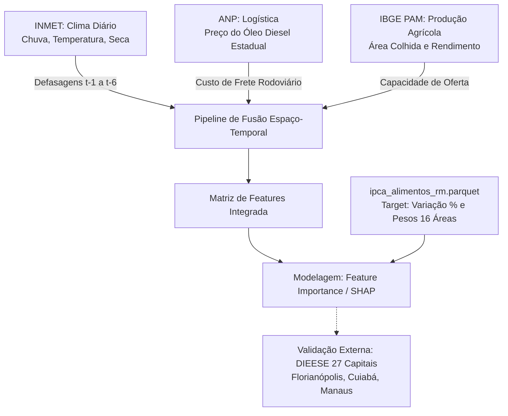

# 📋 Relatório Técnico de Metadados, Análise Semântica e Confronto de Fontes
**Dataset:** `data/raw/sidra_ipca/ipca_alimentos_rm.parquet`  
**Disciplina:** SSC0957 — Prática em Ciência de Dados II  
**Orientado à:** [Proposta 1 — Volatilidade Regional da Cesta Básica e Crises Climáticas](../../docs/Proposta.md)  
**Data da Análise:** Agosto/2026  
**Notebook Associado:** [`notebooks/02_exploration_data-raw_sidra_ipca.ipynb`](../../notebooks/02_exploration_data-raw_sidra_ipca.ipynb)  
**Script de Coleta com Checkpoints:** [`src/coleta/sidra_ipca/01_ibge_ipca_download.py`](../../src/coleta/sidra_ipca/01_ibge_ipca_download.py)

---

## 1. Contexto e Papel do Dataset no Projeto

Na formulação da **Proposta 1**, o objetivo central da equipe é responder com rigor científico:  
> *"O que realmente move o preço da comida no Brasil? Anomalias climáticas na origem, custo de transporte logístico ou pressões macroeconômicas?"*

Dentro da arquitetura de integração multimodal de dados heterogêneos, o dataset `ipca_alimentos_rm.parquet` atua como a **coluna vertebral dos dados de consumo**:
- **Variável-Alvo Dependente ($Y$):** A série de **Variação Mensal (%)** do grupo de alimentos e de 42 itens/subitens individuais representa o *choque de preço* percebido pelo consumidor nas capitais e metrópoles brasileiras.
- **Ponderador de Severidade Social ($w$):** O **Peso Mensal (%)** quantifica o comprometimento real da renda das famílias com cada alimento, permitindo calcular o impacto socioeconômico de cada choque climático.

---

## 2. Metadados Técnicos do Arquivo Parquet

| Atributo | Especificação Técnica |
|---|---|
| **Caminho Físico** | `data/raw/sidra_ipca/ipca_alimentos_rm.parquet` |
| **Origem dos Dados** | API Oficial do IBGE / SIDRA (Tabelas 2938, 1419 e 7060) |
| **Script de Extração** | `src/coleta/sidra_ipca/01_ibge_ipca_download.py` (com Retry e Checkpoints) |
| **Formato de Armazenamento** | Apache Parquet (colunar, compressão Snappy) |
| **Volume Consolidado** | **83.383 linhas $\times$ 8 colunas** |
| **Uso de Memória em RAM** | $\approx 4.8\text{ MB}$ (altamente otimizado) |
| **Extensão Temporal** | Julho/2006 a Julho/2026 (**241 meses / 20 anos**) |
| **Cobertura Geográfica Plena** | **100% das 16 Áreas Urbanas do IPCA** (10 Regiões Metropolitanas + 6 Municípios/Capitais) |

### Dicionário de Variáveis (Schema)

```
Column                     Non-Null Count  Dtype    Significado Semântico
--------------------------------------------------------------------------
ano_mes                    83383 non-null  string   Mês/Ano de referência (formato ISO YYYY-MM)
regiao                     83383 non-null  string   Nome oficial no IBGE (ex: "São Paulo - SP", "Grande Vitória - ES")
capital                    83383 non-null  string   Nome padronizado da Capital associada (ex: "São Paulo", "Vitória")
sigla_uf                   83383 non-null  string   Sigla da Unidade Federativa (ex: "SP", "ES", "DF")
tipo_cobertura             83383 non-null  string   Tipo de abrangência ("Região Metropolitana" ou "Município")
item                       83383 non-null  string   Código e denominação do item/subitem no IPCA (42 categorias)
IPCA - Peso mensal         83383 non-null  float64  Participação do item no orçamento total da família (%)
IPCA - Variação mensal     77335 non-null  float64  Taxa de inflação mensal do item (%)
```

---

## 3. Cobertura Territorial Completa: As 16 Áreas Urbanas do IBGE

Para atingir a máxima representatividade do país, o pipeline unificou as duas granularidades espaciais oficiais do IBGE:
- **10 Regiões Metropolitanas (Nível N7 do SIDRA):** Abrangem os maiores conglomerados urbanos e mercados consumidores do Centro-Sul e Litoral.
- **6 Municípios / Capitais Isoladas (Nível N6 do SIDRA):** Abrangem capitais estratégicas do Centro-Oeste, Norte e Nordeste que não formam RMs no cálculo do IPCA.

```
+---------------------------------------------------------------------------------------------------------+
|                                16 ÁREAS URBANAS PESQUISADAS PELO IBGE                                   |
+----------------------------------------------------+----------------------------------------------------+
|       10 REGIÕES METROPOLITANAS (NÍVEL N7)         |        6 MUNICÍPIOS / CAPITAIS (NÍVEL N6)          |
+----------------------------------------------------+----------------------------------------------------+
| • São Paulo (SP)          • Salvador (BA)          | • Brasília (DF)          • Rio Branco (AC)         |
| • Rio de Janeiro (RJ)     • Recife (PE)            | • Goiânia (GO)           • São Luís (MA)           |
| • Belo Horizonte (MG)     • Fortaleza (CE)         | • Campo Grande (MS)      • Aracaju (SE)            |
| • Curitiba (PR)           • Belém (PA)             |                                                    |
| • Porto Alegre (RS)       • Grande Vitória (ES)    |                                                    |
+----------------------------------------------------+----------------------------------------------------+
```

---

## 4. Análise Semântica e Econômica das Variáveis

### 4.1 Variação Percentual vs. Preço Absoluto em R$
A escolha de modelar a **taxa de variação percentual mensal** ($Δ\%$) em vez do preço nominal em Reais de uma cesta estática traz vantagens cruciais:
1. **Neutralização de Efeitos Fixos Estruturais:** Capitais como São Paulo, Rio de Janeiro e Brasília apresentam custos de moradia, serviços e logística estruturalmente superiores aos de cidades do interior ou do Norte. A modelagem em variação percentual isola o *choque transitório* (inflacionário ou deflacionário) dos níveis base de preços.
2. **Medição Direta de Elasticidades:** Permite estimar coeficientes diretos de sensibilidade climática: *"uma anomalia de $-80\text{ mm}$ de chuva na safrinha do Paraná resulta em $+X\%$ de variação no Feijão Carioca em São Paulo com defasagem de 2 meses"*.

### 4.2 Evidência Empírica da Lei de Engel no Brasil
A análise estatística da coluna `IPCA - Peso mensal` para o grupo `1.Alimentação e bebidas` em todas as 16 áreas confirma empiricamente a **Lei de Engel**:

| Localidade | UF | Tipo de Cobertura | Peso Médio Alimentação (%) | Comprometimento da Renda |
|---|:---:|:---:|:---:|:---:|
| **Belém** | PA | Região Metropolitana | **28.4%** | 🔴 Muito Alto |
| **Aracaju** | SE | Município | **27.7%** | 🔴 Muito Alto |
| **Fortaleza** | CE | Região Metropolitana | **26.3%** | 🔴 Muito Alto |
| **Salvador** | BA | Região Metropolitana | **25.8%** | 🔴 Muito Alto |
| **Recife** | PE | Região Metropolitana | **25.4%** | 🔴 Muito Alto |
| **Rio Branco** | AC | Município | **25.3%** | 🔴 Muito Alto |
| **São Luís** | MA | Município | **25.3%** | 🔴 Muito Alto |
| **Goiânia** | GO | Município | **22.6%** | 🟡 Médio |
| **Campo Grande** | MS | Município | **22.2%** | 🟡 Médio |
| **Porto Alegre** | RS | Região Metropolitana | **22.1%** | 🟡 Médio |
| **Rio de Janeiro**| RJ | Região Metropolitana | **21.8%** | 🟡 Médio |
| **Grande Vitória**| ES | Região Metropolitana | **21.6%** | 🟡 Médio |
| **Belo Horizonte**| MG | Região Metropolitana | **21.4%** | 🟡 Médio |
| **São Paulo** | SP | Região Metropolitana | **21.0%** | 🟢 Menor Comprometimento |
| **Curitiba** | PR | Região Metropolitana | **20.3%** | 🟢 Menor Comprometimento |
| **Brasília** | DF | Município | **18.7%** | 🟢 Menor Comprometimento |

> **Implicação Social:** O impacto de uma quebra de safra é altamente regressivo. Enquanto uma família em Brasília compromete menos de $19\%$ de seus recursos com comida, em Belém, Aracaju e Fortaleza o comprometimento ultrapassa $28\%$, tornando essas populações vulneráveis a choques climáticos severos.

---

## 5. Ranking de Volatilidade e Choques Extremos

```
Top Commodities por Volatilidade (16 Áreas Urbanas)    Desvio Padrão (σ)    Mínimo        Máximo     Comportamento Agronômico
----------------------------------------------------------------------------------------------------------------------------------
1. Tomate                                                   16.85%          -48.50%       +84.10%     Hortifrúti Perecível / Ciclo Curto
2. Batata-inglesa                                           15.40%          -39.20%       +65.30%     Tubérculo / Sensível a Encharcamento e Geada
3. Feijão - carioca (rajado)                                11.20%          -28.50%       +82.09%     Grão Básico / Choques Severos em Safrinha
4. Batata-doce                                               8.45%          -17.20%       +32.10%     Tubérculo Rústico
5. Feijão - preto                                            7.10%          -19.10%       +59.81%     Grão / Mercado Concentrado no Sul e RJ
6. Hortaliças e verduras                                     4.80%          -15.30%       +22.50%     Folhosas / Ciclo Rápido
7. Óleo de soja                                              4.45%          -14.20%       +36.80%     Agroindustrial / Influência da CBOT
8. Arroz                                                     3.60%           -7.10%       +41.94%     Grão Estocável / Irrigado (RS)
9. Café moído                                                3.10%           -8.90%       +24.50%     Lavoura Perene / Bienalidade e Geadas
10. Carnes in natura                                         2.85%           -6.50%       +22.10%     Proteína / Ciclo Pecuário Plurianual
11. Pão francês                                              1.65%           -4.20%        +9.80%     Derivado do Trigo / Custos de Energia e Câmbio
12. Carnes e peixes industrializados                         1.50%           -8.50%        +8.40%     Alimento Processado / Preço Estável
-- Grupo Geral 1.Alimentação e bebidas                       0.98%           -1.80%        +4.85%     Índice Agregado
```

---

## 6. O Uso de Dados do DIEESE: Minúcias, Metodologia e Confronto de Fontes

Uma questão analítica crucial levantada no projeto é:  
> *"Como lidar com as 11 capitais brasileiras que não possuem apuração de IPCA pelo IBGE? É possível ou recomendável usar os dados do DIEESE?"*

### 6.1 Quadro Comparativo de Minúcias Metodológicas: IBGE vs. DIEESE

| Dimensão Metodológica | IBGE (IPCA Alimentos) | DIEESE (Cesta Básica Nacional) |
|---|---|---|
| **Abordagem Central** | **Índice Ponderado de Inflação** (Custo de Vida) | **Custo Físico da Cesta Mínima** (Poder de Compra) |
| **Fundamentação Legal / Teórica** | Pesquisa de Orçamentos Familiares (POF) | Decreto-Lei nº 399 de 30 de abril de 1938 |
| **Estrutura da Cesta** | Ampla e Dinâmica (~400 subitens pesquisados com pesos que variam por hábitos de consumo locais). | Rígida e Estática (13 produtos fixos no Centro-Sul e 12 produtos no Norte/Nordeste). |
| **Unidade de Medida** | Variação Percentual ($Δ\%$) e Números-Índice. | Valor Monetário em Reais ($R\$$), Horas de Trabalho e % do Salário Mínimo. |
| **População-Objetivo** | Famílias com rendimentos de 1 a 40 salários mínimos (consumo familiar global). | Sustento alimentar mensal de 1 trabalhador adulto (necessidades calóricas mínimas). |
| **Cobertura Geográfica** | **16 Áreas Urbanas** (10 RMs + 6 Capitais Isoladas). | **Todas as 27 Capitais do Brasil** (em parceria com a CONAB). |
| **Tratamento Regional** | Pesquisa itens consumidos efetivamente em cada praça com pesos empíricos da POF. | Altera a cesta entre macrozonas (ex: farinha de mandioca no N/NE vs farinha de trigo no C-Sul; sem batata no N/NE). |

---

### 6.2 Por que NÃO fundir matematicamente as bases no mesmo modelo preditivo?
Se um modelo de Machine Learning receber dados do IBGE para 16 capitais e dados do DIEESE para as outras 11 capitais na mesma coluna de variável dependente ($Y$), ocorrerá um **viés de heterogeneidade metodológica**:
1. **Diferença de Ponderação:** Uma alta de $50\%$ no tomate eleva o IPCA geral em apenas $\approx 0.15\%$ (devido ao peso orçamentário reduzido na POF), mas eleva a Cesta do DIEESE em mais de $5\%$ (porque o tomate representa uma cota física fixa de $9\text{ kg}$ ou $12\text{ kg}$ na cesta básica).
2. **Ruído de Medição:** O algoritmo aprenderia a distinguir a *metodologia do instituto* em vez de aprender a *física do clima*.

---

### 6.3 Como utilizar o DIEESE de forma rica e rigorosa no trabalho (Confronto de Fontes)

Seguindo a diretriz do professor Delbem de *"Confrontar as fontes que escolheu com outras fontes associadas ao assunto"*, a utilização ideal do DIEESE no projeto é dividida em duas frentes:

#### 1. Camada de Validação Externa e Contraprova para as 11 Capitais Não Cobertas
O modelo treinado no painel do IBGE (16 áreas) prevê a sensibilidade climática de alimentos essenciais (ex: arroz, feijão, leite, carnes).  
Vocês podem usar os dados do DIEESE em capitais não cobertas pelo IBGE (como **Florianópolis - SC**, **Cuiabá - MT**, **Manaus - AM** ou **Natal - RN**) para responder:
- *"Quando o modelo indica um choque climático de safra no Sul, o preço do arroz na cesta do DIEESE em Florianópolis registrou o mesmo salto observado no IPCA de Curitiba e Porto Alegre?"*
- Isso valida a capacidade de **generalização espacial** dos resultados para o território nacional.

#### 2. Confronto Semântico de Narrativas (LLM + DIEESE + Atas do COPOM)
Utilizar LLMs para cruzar os relatórios mensais textuais do DIEESE com as Atas do COPOM (Banco Central) e os dados do IBGE:
- O DIEESE frequentemente traz análises qualitativas de bastidores sobre especulação de atravessadores, custos de embalagem e fretes regionais que não aparecem nas tabelas frias do IBGE.
- O confronto entre a narrativa do Banco Central (*"inflação de alimentos decorrente de choques climáticos"*), os dados do IBGE e os relatórios do DIEESE fornecerá um diagnóstico qualitativo incomparável no relatório final.

---

## 7. Diretrizes Técnicas para os Próximos Passos de Integração



1. **Mapeamento Espacial de Origem $\to$ Destino:**
   - **Arroz:** Preços nas 16 áreas cruzados com estações INMET no RS (Uruguaiana, Alegrete, Santa Maria).
   - **Feijão Carioca:** Cruzamento com estações INMET de Minas Gerais (Unaí), Goiás (Cristalina) e Paraná (Castro/Ponta Grossa).
   - **Hortifrútis (Tomate/Batata):** Cruzamento com cinturões verdes locais de cada uma das 10 Regiões Metropolitanas e 6 Capitais.
2. **Isolamento do Componente Logístico (ANP):**
   - Série histórica do diesel na UF de destino para separar o encarecimento por frete do encarecimento por choque climático na roça.
3. **Engenharia de Defasagens (*Lags*):**
   - Criação de janelas de $1, 2, 3 \text{ e } 6$ meses para respeitar a defasagem biológica entre o evento climático no campo e o reflexo na gôndola do supermercado.

---

*Relatório técnico consolidado para o repositório `trabalho_pcd2` como parte da entrega da Fase 1 e 2 da disciplina SSC0957.*
