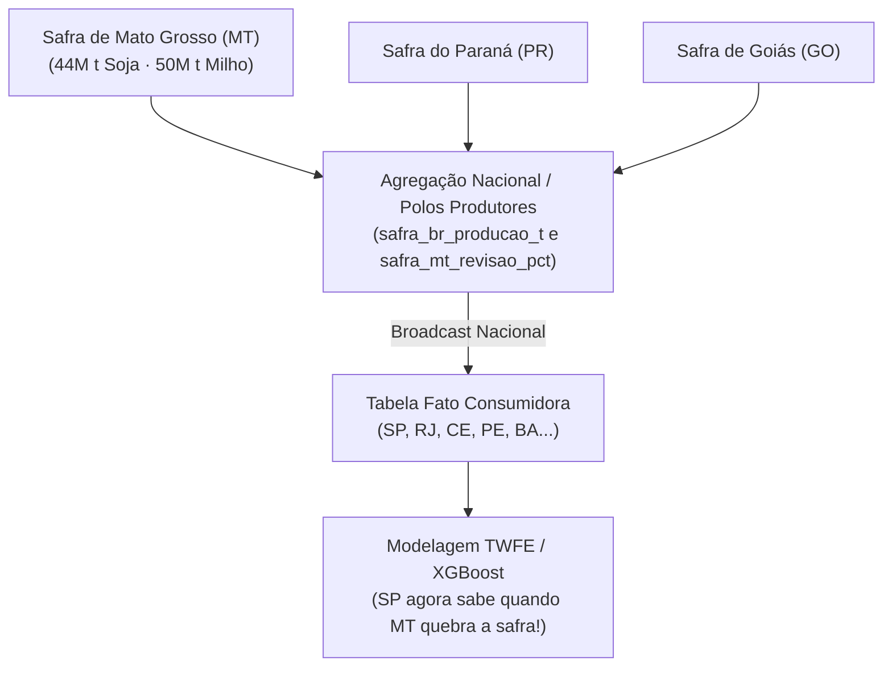

# 🌾 Análise Técnica: Cobertura das 11 UFs sem IPCA e o Destino da Safra do Mato Grosso (MT)

**Projeto:** SSC0957 — Prática em Ciência de Dados II (2026)  
**Documento:** `docs/analises/analise_cobertura_safra_mt.md`  
**Data:** Setembro de 2026  
**Status:** Análise Concluída e Recomendação Metodológica para a Etapa 2  

---

## 1. Contexto e Motivação da Investigação

Ao auditar a tabela primária de preços ao consumidor ([`data/interim/ipca_alimentos_rm.parquet`](../../data/interim/ipca_alimentos_rm.parquet)), constatou-se que o alvo do projeto (`ipca_var_alimentacao`) cobre exclusivamente **16 Unidades da Federação**. Consequentemente, **11 UFs brasileiras não possuem dados de IPCA**.

Dentre as 11 UFs ausentes, destaca-se o estado de **Mato Grosso (MT)** — o maior polo agropecuário e produtor de grãos (soja e milho) do Brasil e do mundo.

Esta análise responde a quatro questões críticas:
1. *A esteira de dados desconsiderou os dados de safra do Mato Grosso?*
2. *Qual é o tamanho real do Mato Grosso na produção agrícola nacional?*
3. *Onde e como o filtro aconteceu no código-fonte?*
4. *Qual é o impacto econométrico para os estados consumidores e como solucionar essa lacuna nas próximas etapas?*

---

## 2. Auditoria da Cobertura Territorial das UFs

Cruzando [`data/interim/ipca_alimentos_rm.parquet`](../../data/interim/ipca_alimentos_rm.parquet) com a dimensão canônica [`data/processed/dim_uf.csv`](../../data/processed/dim_uf.csv):

| Grupo | Total | UFs Incluídas | Justificativa Institucional (IBGE) |
|---|:---:|---|---|
| **UFs com IPCA (Presentes)** | **16** | `AC`, `BA`, `CE`, `DF`, `GO`, `MA`, `MG`, `MS`, `PA`, `PE`, `PR`, `RJ`, `RS`, `SE`, `SP` | O SNIPC/IBGE coleta preços em 10 Regiões Metropolitanas e 6 capitais/municípios isolados. |
| **UFs sem IPCA (Ausentes)** | **11** | `AL`, `AM`, `AP`, **`MT`**, `PB`, `PI`, `RN`, `RO`, `RR`, `SC`, `TO` | Estados onde o IBGE não realiza a pesquisa domiciliar contínua de preços ao consumidor do IPCA. |

> [!IMPORTANT]
> A ausência de MT não é um erro de raspagem de dados; é uma restrição amostral metodológica do próprio IBGE/SNIPC.

---

## 3. O Peso Agrícola do Mato Grosso: Dados Reais Auditados

Auditamos a base de safras em [`data/interim/safra_uf_mes.parquet`](../../data/interim/safra_uf_mes.parquet) no fechamento oficial anual de 2023 (safra consolidada em dezembro/2023):

### 3.1. Soja em Grão (2023)
- **Produção Nacional Total:** 151.963.045 toneladas
- **Produção de Mato Grosso (MT):** **44.462.908 toneladas**
- **Participação de MT no Brasil:** **29,26 % de toda a soja brasileira!**

#### Ranking dos 5 Maiores Produtores de Soja:
| Posição | UF | Produção Anual (t) | % da Safra Nacional | Presente no IPCA / Tabela Fato? |
|:---:|:---:|:---:|:---:|:---:|
| **1º** | **MT** | **44.462.908** | **29,26 %** | ❌ **NÃO (Descartado)** |
| 2º | PR | 22.455.000 | 14,78 % | ✅ SIM |
| 3º | GO | 16.749.192 | 11,02 % | ✅ SIM |
| 4º | MS | 14.193.250 | 9,34 % | ✅ SIM |
| 5º | RS | 12.693.487 | 8,35 % | ✅ SIM |

---

### 3.2. Milho em Grão (2023)
- **Produção Nacional Total:** 131.085.011 toneladas
- **Produção de Mato Grosso (MT):** **50.543.494 toneladas**
- **Participação de MT no Brasil:** **38,56 % de todo o milho brasileiro!** (Quase 40% do milho do país).

#### Ranking dos 5 Maiores Produtores de Milho:
| Posição | UF | Produção Anual (t) | % da Safra Nacional | Presente no IPCA / Tabela Fato? |
|:---:|:---:|:---:|:---:|:---:|
| **1º** | **MT** | **50.543.494** | **38,56 %** | ❌ **NÃO (Descartado)** |
| 2º | PR | 17.958.800 | 13,70 % | ✅ SIM |
| 3º | GO | 14.048.839 | 10,72 % | ✅ SIM |
| 4º | MS | 13.468.542 | 10,27 % | ✅ SIM |
| 5º | MG | 8.296.982 | 6,33 % | ✅ SIM |

---

## 4. Onde e Como o Descarte Ocorreu no Pipeline

Rastreando a execução em [`src/tratamento/24_junta.py`](../../src/tratamento/24_junta.py):

1. **A Espinha Dorsal Preserva MT:**
   A função `monta_calendario()` gera o produto cartesiano das 27 UFs com os 138 meses ($27 \times 138 = 3.726$ linhas). O arquivo [`data/processed/calendario_uf_mes.parquet`](../../data/processed/calendario_uf_mes.parquet) **CONTÉM o Mato Grosso**.
2. **Os 5 LEFT JOINs Preservam MT:**
   - Durante os merges com `clima`, `safra`, `seca` e `macro`, a chave `(sigla_uf, ano_mes)` casa perfeitamente para MT.
   - O DataFrame intermediário atinge 3.726 linhas contendo todas as variáveis de produção física de MT (`safra_producao_t_soja = 44,4` milhões de t e `safra_producao_t_milho = 50,5` milhões de t).
3. **O Filtro Final Elimina MT ([`24_junta.py:268`](../../src/tratamento/24_junta.py#L268)):**
   ```python
   # Como ipca_var_alimentacao é NaN para MT:
   fato = fato[fato["ipca_var_alimentacao"].notna()].reset_index(drop=True)
   ```
   Como o objetivo da tabela final é servir de matriz de design $X \to y$ para aprendizado supervisionado da inflação local, **todas as 138 linhas do Mato Grosso foram filtradas e excluídas da tabela final** ([`data/processed/fato_alimentos_combustiveis_uf_mes.parquet`](../../data/processed/fato_alimentos_combustiveis_uf_mes.parquet), que possui exatamente 2.088 linhas).

---

## 5. A Consequência Econométrica: O "Ponto Cego" dos Estados Consumidores

No desenho tabular largo (*wide*) atual, cada linha representa uma entidade espaço-temporal observada `(sigla_uf, ano_mes)`:

$$\begin{bmatrix}
\text{UF} & \text{ano\_mes} & \text{IPCA Alimentos (Alvo)} & \text{Safra Soja} & \text{Safra Milho} \\
\text{SP} & \text{2021-03} & +1,85\% & 4.500.000\text{ t} & 3.200.000\text{ t} \\
\text{RJ} & \text{2021-03} & +2,10\% & 0\text{ t} & 80.000\text{ t} \\
\end{bmatrix}$$

### O Mecanismo da Falha de Transmissão:
- São Paulo e Rio de Janeiro são gigantescos centros urbanos consumidores de alimentos processados (óleo de soja, farelo de soja para ração de frango e ovos, farinha de milho, carnes suínas).
- A produção própria de soja do estado de São Paulo (~4,5 milhões de t) atende a uma fração mínima de sua demanda industrial; o Rio de Janeiro tem produção zero.
- Todo o suprimento dessas commodities agrícolas desce das lavouras de **Mato Grosso, Goiás e Mato Grosso do Sul**.
- **O Problema:** Se uma seca devastadora destruir 20 milhões de toneladas de soja no Mato Grosso, o preço da comida explodirá nas prateleiras dos supermercados de SP e do RJ. Contudo, **como MT não está na tabela final, a linha de SP registra apenas a safra local de SP!**
- O modelo de Machine Learning ou regressão econométrica de São Paulo **não recebe a informação de que a safra de Mato Grosso quebrou**, atribuindo falsamente a inflação alimentar a outros fatores (como câmbio ou ruído estocástico).

---

## 6. Onde os Dados Estão Salvos Intactos no Repositório?

Nenhum dado do Mato Grosso foi perdido ou deletado do projeto:
- ✅ [`data/interim/safra_uf_mes.parquet`](../../data/interim/safra_uf_mes.parquet): Contém a série histórica completa de todas as 27 UFs para os 11 produtos agrícolas em 151 meses (44.847 linhas).
- ✅ [`data/interim/producao_uf_ano.parquet`](../../data/interim/producao_uf_ano.parquet): Contém a produção anual e área colhida de todas as 27 UFs apuradas pela PAM (Pesquisa Agrícola Municipal).
- ✅ [`data/processed/calendario_uf_mes.parquet`](../../data/processed/calendario_uf_mes.parquet): A grade cartesiana de 27 UFs × 138 meses (3.726 linhas) está intacta em disco.

---

## 7. Soluções Metodológicas Recomendadas para a Próxima Sessão

Para que a quebra de safra do Mato Grosso e dos demais grandes produtores alimente com rigor a previsão de inflação dos 16 estados consumidores, recomendamos implementar três frentes:



### 7.1. Solução 1 (Imediata): Features de Safra Nacional por *Broadcast*
Calcular a soma da produção nacional e as revisões percentuais ponderadas das grandes commodities (ou isolar o choque específico de MT) e replicar essas colunas em todas as UFs consumidoras:
- `safra_br_producao_t_soja`: Produção total nacional de soja (onde MT representa 29,3%).
- `safra_br_revisao_pct_soja`: Taxa de revisão mensal da safra nacional de soja.
- `safra_br_producao_t_milho` e `safra_br_revisao_pct_milho`.
- `safra_mt_revisao_pct_soja`: A revisão da estimativa do Mato Grosso como variável explícita de choque de oferta agropecuária.
*Vantagem:* Implementação imediata em Pandas no pré-processamento de features, sem quebrar o grão `(sigla_uf, ano_mes)` da tabela fato.

### 7.2. Solução 2 (Ticket T-022): Ponderação Espacial pelo PAM
Conforme previsto no ticket T-022, utilizar os pesos de produção agrícola da PAM ([`producao_uf_ano.parquet`](../../data/interim/producao_uf_ano.parquet)) para ponderar o impacto de secas e choques climáticos nos polos fornecedores sobre o índice de custo alimentar do país.

### 7.3. Solução 3 (Modelagem Espacial): Matriz de Dependência Interestadual
Modelar o transbordamento espacial (*spatial spillovers*) por meio de uma matriz de pesos espaciais $W$ (utilizando PySAL ou matriz de fluxo de transporte de cargas da ANTT/SIFRECA), permitindo que:
$$\Delta \text{IPCA}_{i, t} = \rho \sum_{j \ne i} W_{ij} \text{Safra}_{j, t} + X_{i, t} \beta + \epsilon_{i, t}$$
onde o peso $W_{SP, MT}$ reflete o fluxo de escoamento de grãos do Centro-Oeste para a Região Sudeste.

---

## 8. Conclusão da Auditoria

1. **A tabela final filtrou MT corretamente do ponto de vista do alvo supervisionado** (não é possível prever um $y$ inexistente).
2. **A tabela final sofre de um ponto cego agronômico no formato puramente local**, pois o estado de SP e RJ não têm acesso ao choque de MT.
3. **A solução de engenharia de dados é simples e elegante:** calcular os agregados de safra nacional e de polos fornecedores e transmiti-los via *broadcast* para todas as linhas da tabela analítica, enriquecendo o poder preditivo dos modelos sem violar a integridade relacional do dataset.
