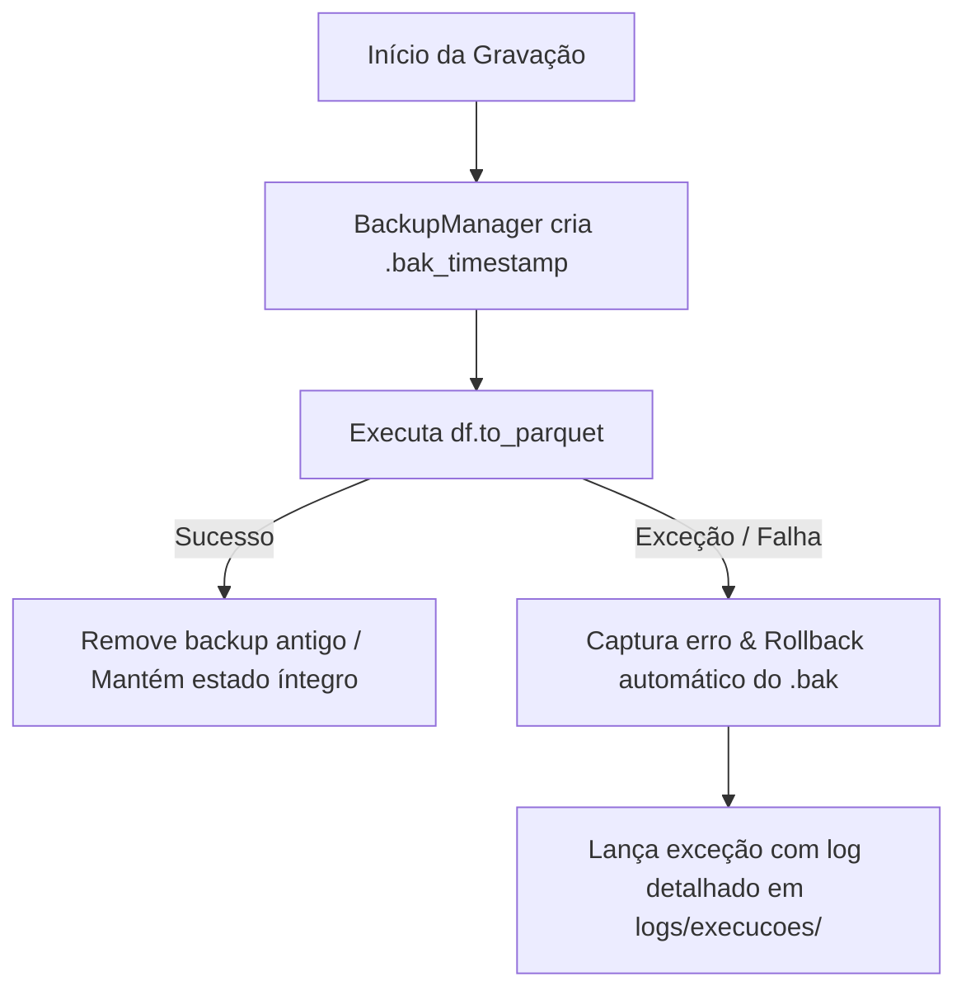

# 📘 Módulo 1: Fundamentos, Escopo e Arquitetura do Pipeline (Slides 1 a 4)

Este documento prepara o palestrante para defender os fundamentos conceituais e arquiteturais do projeto contra questionamentos rigorosos da banca.

---

## 📌 Slide 1 — Capa: "O que realmente move o preço da comida no Brasil?"

### 1. Resumo Executivo e Mensagem Central
- **Problema:** A opinião pública e a imprensa reduzem a inflação alimentar a narrativas monocausais ("a culpa é da seca" ou "a culpa é do dólar/guerra").
- **Hipótese de Trabalho:** A formação do preço dos alimentos é um fenômeno **dinâmico, multifatorial e regionalmente assimétrico**, impulsionado simultaneamente por choques climáticos locais, quebras de safra, variáveis macroeconômicas de perda de poder aquisitivo e custos de transporte rodoviário.
- **Entrega Concreta:** Uma tabela retangular única no grão `UF × mês`, contendo **2.088 linhas × 108 colunas**, cobrindo 16 UFs ao longo de 138 meses (janeiro/2015 a junho/2026), integrando 6 pesquisas de 5 órgãos públicos oficiais.

### 2. Mapeamento Direto no Código
- Tabela gerada: [`data/processed/fato_alimentos_combustiveis_uf_mes.parquet`](../../data/processed/fato_alimentos_combustiveis_uf_mes.parquet)
- Dicionário de metadados: [`outputs/tabelas/dicionario_variaveis_combustiveis.csv`](../../outputs/tabelas/dicionario_variaveis_combustiveis.csv)
- Orquestrador de ponta a ponta: [`src/coleta/runner.py`](../../src/coleta/runner.py)

### 3. Decisões Críticas de Engenharia e Estatística
- **Por que 16 UFs e não as 27 do território nacional?**  
  O alvo primário é a inflação ao consumidor medida pelo **IPCA (IBGE/SNIPC)**. O IBGE não coleta IPCA em todos os estados da federação; sua amostra urbana compreende 10 Regiões Metropolitanas (SP, RJ, MG, PR, RS, BA, PE, CE, PA, ES) e 6 municípios isolados (DF, GO, MS, AC, MA, SE). Forçar 27 UFs na modelagem final resultaria em 40,7% de target nulo estrutural. Contudo, **a engenharia preservou as 27 UFs na espinha dorsal** ([`calendario_uf_mes.parquet`](../../data/processed/calendario_uf_mes.parquet), 3.726 linhas) para que qualquer outro pesquisador possa modelar safras ou secas nas 27 UFs.
- **Por que a janela 2015-01 a 2026-06 (138 meses)?**  
  É a interseção máxima de alta confiabilidade entre as 6 bases. O Monitor de Secas da ANA teve início de dados consolidados em 2014-07 no semiárido, estabilizando-se em 2015-01. Junho de 2026 é o último mês fechado com publicação consolidada conjunta no momento de corte do projeto.
- **Por que formato largo (wide) em vez de formato relacional longo (long)?**  
  Algoritmos de aprendizado de máquina tabular (XGBoost, Random Forest, LightGBM) e modelos de regressão de painel econométrico (Two-Way Fixed Effects) exigem matriz de design $X \in \mathbb{R}^{N \times P}$ onde cada linha é uma entidade espaço-temporal observada $(i, t)$ e cada coluna é uma feature explicativa alinhada.

### 4. Perguntas Prováveis da Banca e Respostas Afiadas

> **Pergunta da Banca:** *"108 variáveis para 2.088 linhas não é uma relação amostra/parâmetro muito baixa? Vocês não vão sofrer da maldição da dimensionalidade ou overfitting?"*  
> **Resposta do Palestrante:**  
> "Excelente colocação, professor. É crucial destacar que as 108 colunas não são todas regressores simultâneos em uma única regressão linear OLS. Elas formam um catálogo estruturado em blocos:
> 1. Três alvos distintos: variação mensal pura (`ipca_var_alimentacao`), acumulado em 12 meses (`ipca_var_alimentacao_acum12`) e o excesso alimentar relativo à inflação geral (`ipca_var_alimentacao_relativa`).
> 2. Variáveis de controle descritivas e flags de observabilidade (ex: `comb_observado_liquidos`, `seca_monitorado`).
> 3. Séries desagregadas por item da cesta básica (ex: subitem arroz vs safra de arroz) para modelos temáticos.
> Ao modelar o grupo agregado, utilizaremos seleção de features por regularização L1 (LASSO), ElasticNet e árvores de decisão com controle estrito de profundidade e cross-validation temporal em blocos expansivos, eliminando o risco de sobreajuste."

> **Pergunta da Banca:** *"Por que não incluir dados anteriores a 2015 para aumentar o N amostral?"*  
> **Resposta do Palestrante:**  
> "Porque introduziríamos um viés severo de seleção amostral: o Monitor de Secas da ANA simplesmente não existia antes de meados de 2014, e os dados horários do INMET pré-2014 tinham uma proporção de estações automáticas muito inferior. Estender para 2006 (onde o IPCA existe) deixaria 50% da matriz de variáveis explicativas vazia, forçando imputações que distorceriam a dinâmica climática real."

### 5. Armadilhas de Linguagem (O que NUNCA dizer)
- ❌ **Nunca diga:** *"Nós jogamos fora as outras 11 UFs porque não importavam."*  
  ✅ **Diga:** *"Preservamos as 27 UFs na espinha dorsal de calendário e fizemos o corte estrito de 16 UFs apenas na etapa final de treinamento supervisionado, pois são as únicas com alvo medido pelo IBGE."*
- ❌ **Nunca diga:** *"108 colunas são todas variáveis independentes do nosso modelo."*  
  ✅ **Diga:** *"108 colunas compõem a base fato analítica, incluindo 3 alvos, metadados de auditoria e blocos de regressores desagregados."*

---

## 📌 Slide 2 — A pergunta e o desenho da tabela

### 1. Resumo Executivo e Mensagem Central
- O desafio primário em Ciência de Dados do mundo real não é o algoritmo de ML, mas a **heterogeneidade de grão nativo**:
  - Clima chega no grão **estação meteorológica × hora/dia**.
  - Safra chega no grão **UF × produto agrícola × mês**.
  - IPCA chega no grão **área urbana × código de subitem × mês**.
  - Macroeconomia chega no grão **Brasil × dia/mês**.
  - Combustíveis chegam no grão **UF × produto derivado × mês**.
- **Denominador Comum Irredutível:** No corte transversal e longitudinal brasileiro, as únicas dimensões compartilhadas por todos os entes públicos são a **UF (Unidade da Federação)** e o **mês de referência**.

### 2. Mapeamento Direto no Código
- Definição da chave primária composta: [`src/tratamento/chaves.py`](../../src/tratamento/chaves.py#L1-L16)
- Criação da grade cartesiana: [`src/tratamento/24_junta.py:monta_calendario()`](../../src/tratamento/24_junta.py#L114-L127)

### 3. Decisões Críticas de Engenharia e Estatística
- **O Dilema Espacial: Área Urbana vs. Interior Agrícola.**  
  O IPCA mede o preço nas prateleiras dos supermercados das capitais/regiões metropolitanas. Já a chuva e as lavouras de grãos estão no interior do estado.  
  *Por que agregar na UF?* A UF é a menor unidade institucional e de mercado que unifica a política tributária (ICMS de combustíveis e alimentos), a logística de abastecimento de entrepostos (CEASAs estaduais) e a bacia de produção agrícola regional.
- **Por que a resolução temporal mensal?**  
  A safra (LSPA) e a inflação oficial (IPCA) são apuradas e publicadas exclusivamente em base mensal. Qualquer tentativa de modelagem diária ou semanal exigiria interpolações artificiais do alvo, introduzindo autocorrelação sintética inaceitável.

### 4. Perguntas Prováveis da Banca e Respostas Afiadas

> **Pergunta da Banca:** *"O clima de São Paulo capital é completamente diferente do clima de Ribeirão Preto ou Franca, onde está o agronegócio paulista. Ao agregar a UF inteira pela mediana das estações, vocês não estão introduzindo um erro ecológico de representatividade espacial?"*  
> **Resposta do Palestrante:**  
> "A observação é cirúrgica e toca no cerne do projeto. A agregação territorial por mediana simples das estações da UF é a nossa linha de base homogênea (etapa T-021). No entanto, já deixamos arquitetado e documentado o passo **T-022**, no qual o catálogo de latitude e longitude das 701 estações do INMET é ponderado pela área colhida e produção agrícola municipal de cada cultura via PAM (Pesquisa Agrícola Municipal). Isso permite calcular o índice de choque climático focado onde a cultura de fato reside. Mesmo no modelo base com mediana de UF, o estado funciona como um integrador logístico: se chover no estado todo, o transporte rodoviário e as hortaliças do cinturão verde da capital são impactados diretamente."

### 5. Armadilhas de Linguagem
- ❌ **Nunca diga:** *"O grão de todas as bases era compatível."*  
  ✅ **Diga:** *"Nenhuma fonte conversa com as outras em seu grão nativo; a harmonização para UF × mês exigiu redução matemática específica para cada fenômeno físico e econômico."*

---

## 📌 Slide 3 — As seis fontes de dados

### 1. Resumo Executivo e Mensagem Central
- O projeto atende com folga ao requisito da disciplina (exigia $\ge 3$ fontes heterogêneas). Entregamos **6 pesquisas de 5 órgãos do Estado**:
  1. **IBGE / SIDRA (SNIPC):** O alvo (inflação ao consumidor e pesos na cesta básica).
  2. **INMET / BDMEP:** Chuva diária, temperaturas e extremos climáticos.
  3. **ANA / Monitor de Secas:** Severidade e proporção de área estadual em seca.
  4. **IBGE / SIDRA (LSPA + PAM):** Estimativa mensal de safra e área colhida de 11 produtos.
  5. **BCB / SGS:** Vetor macroeconômico (câmbio PTAX, Selic, IPCA geral nacional, IGP-M).
  6. **ANP:** Preço de venda ao consumidor e postos pesquisados de 5 combustíveis.
- **Reprodutibilidade 100% Livre:** Nenhuma fonte exige token pago, credencial privada ou chave de acesso. Qualquer avaliador pode clonar o repositório e reproduzir a esteira integralmente.

### 2. Mapeamento Direto no Código
- Catálogo centralizado de coletores: [`src/coleta/runner.py:COLETORES`](../../src/coleta/runner.py#L71-L85)
- Módulo de rede resiliente com retries e backoff: [`src/rede.py`](../../src/rede.py)
- Submódulos dedicados em [`src/coleta/`](../../src/coleta/)

### 3. Decisões Críticas de Engenharia e Estatística
- **A distinção epistemológica das duas pesquisas do IBGE:**  
  O IPCA e o LSPA pertencem ao IBGE, mas são pesquisas completamente distintas:
  - *IPCA-SNIPC:* Pesquisa domiciliar de orçamento e coleta contínua em estabelecimentos comerciais urbanos. Metodologia de Laspeyres encadeado.
  - *LSPA:* Painel agrário conduzido por Comissões Municipais (COMEA) e Estaduais (COREA) de Estatísticas Agropecuárias, envolvendo agrônomos, cooperativas e técnicos da extensão rural no campo.
- **Engenharia Reversa da API da ANA:**  
  A Agência Nacional de Águas disponibiliza dados em interface web Angular que renderiza tabelas via JavaScript. Em vez de utilizar Selenium/Playwright (pesados e propensos a quebra), a equipe inspecionou o tráfego de rede e identificou a rota RPC REST aberta (`apimsbr.ana.gov.br/rpc/v1/dados-tabulares-monitor`), permitindo download assíncrono em menos de 40 segundos para todo o Brasil.

### 4. Perguntas Prováveis da Banca e Respostas Afiadas

> **Pergunta da Banca:** *"Vocês coletaram dados do Banco Central (SGS) para dólar e juros, mas essas variáveis são idênticas para todas as UFs no mesmo mês. Qual é a utilidade estatística de incluir variáveis invariantes no corte transversal em um painel espacial?"*  
> **Resposta do Palestrante:**  
> "Essa é uma distinção conceitual fundamental: as variáveis do Banco Central entram como **variáveis de controle macroeconômico**. Sem controlar pelo IPCA geral do país e pela desvalorização cambial (PTAX), qualquer modelo de série temporal atribuiria falsamente ao clima ou à safra local o que é mera desvalorização nominal da moeda brasileira. Além disso, criamos a métrica `ipca_var_alimentacao_relativa` justamente subtraindo o IPCA geral do Banco Central do IPCA de alimentos da UF, isolando o choque específico do setor alimentício."

---

## 📌 Slide 4 — O pipeline em três camadas

### 1. Resumo Executivo e Mensagem Central
- Arquitetura Medalhão consolidada na engenharia de dados corporativa:
  - `data/raw/`: Dados exatamente como baixados das fontes, **estritamente imutáveis**.
  - `data/interim/`: Tabelas tratadas individualmente por fonte, limpas de anomalias e padronizadas no grão canônico.
  - `data/processed/`: Tabelas integradas relacionais (`fato_*`) e dimensões territoriais (`dim_uf.csv`), prontas para modelagem.
- **Robustez de Engenharia:**
  - Idempotência: rodar 1 ou 100 vezes gera o mesmo estado de disco.
  - Atomicidade com rollback automático via context manager `BackupManager`.
  - Auditoria completa sem chamadas de rede através de `python -m src.coleta.runner --status`.

### 2. Mapeamento Direto no Código
- Context Manager de Backup e Rollback: [`src/logging_config.py:BackupManager`](../../src/logging_config.py#L170-L245)
- Auditoria de disco em tempo real: [`src/coleta/runner.py:auditar_disco()`](../../src/coleta/runner.py#L112-L210)
- Configuração de caminhos do projeto: [`src/config.py`](../../src/config.py)

### 3. Decisões Críticas de Engenharia e Estatística
- **Por que Parquet colunar e não CSV ou SQLite?**  
  O Parquet implementa compressão Snappy colunar com tipagem estrita no próprio arquivo (schema embutido). Um dataset como o de clima diário bruto possui 2,54 milhões de linhas: em CSV descompactado ocuparia ~500 MB; em Parquet ocupa 48 MB e permite leitura filtrada em milissegundos com vetorização SIMD.
- **A salvaguarda de atomicidade em disco:**  
  Se um processo de escrita em Parquet for interrompido por falta de energia, estouro de memória (OOM) ou cancelamento pelo usuário, um arquivo corrompido de 0 bytes inviabilizaria os scripts subsequentes. O `BackupManager` grava sob cópia de segurança temporal (`.bak_YYYYMMDD_HHMMSS`) e restaura a versão anterior caso ocorra qualquer exceção.

### 4. Perguntas Prováveis da Banca e Respostas Afiadas

> **Pergunta da Banca:** *"Por que não utilizaram uma ferramenta de orquestração como Apache Airflow, Dagster ou Prefect?"*  
> **Resposta do Palestrante:**  
> "Adotamos o princípio de Navalha de Occam na engenharia de software: introduzir Airflow ou Docker demandaria daemons em segundo plano, dependências de banco de dados relacional e sobrecarga desnecessária para um pipeline que é totalmente determinístico e executa em minutos. Nosso runner CLI [`src/coleta/runner.py`](../../src/coleta/runner.py) fornece orquestração modular, paralelismo controlado, flags idempotentes (`--overwrite skip`, `--force`, `--tratamento`) e logging em 4 camadas sem adicionar dependências externas de infraestrutura."

### 5. Armadilhas de Linguagem
- ❌ **Nunca diga:** *"Se der erro, a gente roda o script de novo do zero baixando tudo."*  
  ✅ **Diga:** *"O pipeline opera sob checkpoints atômicos idempotentes; caso ocorra falha, o `BackupManager` faz rollback e uma nova execução reutiliza os estágios íntegros já salvos em disco."*
