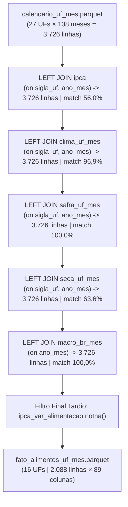

# 📘 Módulo 3: Redução ao Grão Comum, Junção Central e Combustíveis (Slides 8 a 10)

Este documento capacita o palestrante a explicar detalhadamente as regras de transformação estatística de cada fonte, a topologia de junção do pipeline e a inclusão fundamentada da base de combustíveis com sua validação por testemunha.

---

## 📌 Slide 8 — Cada fonte reduzida ao grão comum

### 1. Resumo Executivo e Mensagem Central
- Antes de qualquer merge, cada fonte precisa ser reduzida a uma tabela intermediária limpa no grão exato `UF × mês`.
- Não se trata de uma simples conversão de formato: cada grandeza física, econômica e agronômica exige regras matemáticas distintas de redução.
- **Regra de Ouro Transversal:** *Agregar apenas depois de assegurar que o dado agregado tem significado físico/estatístico real.* Um mês com 3 dias de medição não representa o clima do mês; uma taxa de variação sobre denominador quase nulo gera distorções infinitas.

---

### 2. Regras de Redução por Fonte e Decisões Não-Óbvias

| Fonte | De (Grão de Entrada) | Para (`UF × mês`) | Regra Estatística de Redução | Decisão Não-Óbvia de Engenharia |
|---|---|---|---|---|
| **IPCA** | 83.383 linhas × 40 códigos de item | 34 colunas largas | Pivotamento sobre os 17 códigos de cobertura total | Chaveamento por **código numérico**, nunca por nome (IBGE renomeia itens na série). |
| **Clima** | 83.814 estação-mês (701 estações) | 4.077 UF-mês | **Mediana** entre estações válidas + `n_estacoes` | Descarte de estação-mês com **< 70% de dias válidos** antes da agregação; **não somar** chuva entre estações. |
| **Safra** | 44.847 linhas × 11 produtos | 22 colunas largas | Pivotamento de 11 produtos × 2 métricas | **Winsorização de `revisao_pct_prod` em ±50%**; ausência de lavoura vira 0 tonelada. |
| **Seca** | 3.726 linhas já em UF × mês | 9 colunas | Padronização de chave e desacumulação | Desacumulação das categorias $S_0$ a $S_4$ para cálculo da severidade ponderada sobre a área total. |
| **Macro** | 151 linhas nacionais | 5 colunas | Broadcast por `ano_mes` | Variável idêntica nas 27 UFs — entra apenas como controle macroeconômico. |
| **Combustível** | 26.446 linhas × 8 produtos | 19 colunas | Média ponderada por postos pesquisados | Descarte de produtos descontinuados (Diesel S50, Gasolina Aditivada, GNV) e cálculo de desvio espacial. |

---

### 3. As Três Decisões Estatísticas Críticas em Detalhes

#### 1. Clima: O Corte de 70% e a Mediana Espacial ([`src/tratamento/21_clima_uf_mes.py:44-90`](../../src/tratamento/21_clima_uf_mes.py#L44-L90))
- **O Descarte Prévio:** 22,8% das estações-mês monitoradas tinham menos de 70% dos dias válidos no mês (devido a falhas no pluviômetro, interrupção de transmissão solar, etc.).  
  Se um pluviômetro mediu apenas 4 dias de chuva (30 mm) e passou 26 dias quebrado, registrar 30 mm como o acumulado do mês criaria uma falsa seca extrema. O código mascara todas essas medidas com `NaN` **antes** de calcular a mediana da UF.
- **Por que Mediana e NUNCA Soma ou Média entre Estações?**  
  - *Soma:* Somar a precipitação das ~100 estações do Rio Grande do Sul geraria um acumulado fictício de ~50.000 mm de chuva no mês! "Chuva soma" aplica-se apenas no tempo (hora $\to$ dia $\to$ mês na mesma estação), **nunca no espaço**.
  - *Mediana:* Estações meteorológicas automáticas sofrem panes ocasionais (ex: sensor de temperatura travado em 45 °C ou pluviômetro entupido marcando 0). A média seria severamente corrompida por esses outliers; a mediana é o estimador estatístico robusto de ponto de quebra máximo (breakdown point de 50%).

#### 2. Safra: A Winsorização em ±50% da Revisão ([`src/tratamento/24_junta.py:89-93`](../../src/tratamento/24_junta.py#L89-L93))
- **A Patologia da Revisão Percentual:**  
  $$\text{revisao\_pct} = \left( \frac{\text{Previsão Mês } t}{\text{Previsão Mês } t-1} - 1 \right) \times 100$$
  Em estados onde uma determinada cultura é incipiente (ex: trigo no Ceará ou banana em Roraima), a estimativa pode passar de 1 tonelada para 150.000 toneladas com a inclusão de um polo irrigado. Isso gera uma taxa de revisão de **15.000.000%**!
- **A Solução:** Uma única linha com 15 milhões % distorceria os gradientes de qualquer regressão ou rede neural. A equipe analisou a distribuição empírica e constatou que **96,6% de todas as revisões reais de safra cabem no intervalo $[-20\%, +20\%]$**.  
  Aplicou-se a técnica de **winsorização em $\pm 50\%$** (`df['revisao_pct_prod'].clip(-50.0, 50.0)`):
  - **99,1% dos dados reais permanecem 100% inalterados**.
  - Apenas as caudas anômalas resultantes de divisão por base ínfima são truncadas, preservando o sinal de choque positivo ou negativo.

#### 3. IPCA: Chaveamento Estrito por Código Numérico ([`24_junta.py:142-146`](../../src/tratamento/24_junta.py#L142-L146))
- O campo bruto de item do IBGE combina código e descrição: `"1101002.Arroz"`.
- Chavear pelo nome textual quebraria a série histórica:
  - O código `1111004` chamava-se *"Leite pasteurizado"* até dezembro/2011 e foi renomeado pelo IBGE para *"Leite longa vida"* a partir de janeiro/2012. Agrupar por nome dividiria o histórico do leite em duas colunas com 50% de nulos cada.
  - O código `1101053` mudou de grafia de *"Feijão macassar"* para *"Feijão macáçar"* em 2020.
- O pipeline extrai `cod_item = df["item"].str.split(".").str[0]` e ancora a junção exclusivamente no código numérico fixo.

---

## 📌 Slide 9 — A junção: uma espinha de calendário e cinco LEFT JOINs

### 1. Resumo Executivo e Mensagem Central
- A arquitetura da junção central T-024 ([`src/tratamento/24_junta.py`](../../src/tratamento/24_junta.py)) baseia-se em dois princípios inegociáveis:
  1. **A espinha dorsal é o calendário cartesiano, nunca o alvo:** A tabela começa com todas as 27 UFs e todos os 138 meses ($27 \times 138 = 3.726$ linhas).
  2. **Todo merge é estritamente `LEFT JOIN`:** Nenhuma linha pode sumir durante os cruzamentos intermediários.
- **Auditoria de Invariância:** O número de 3.726 linhas é auditado e mantido exatamente idêntico ao final de cada um dos 5 merges (`ipca`, `clima`, `safra`, `seca`, `macro`).
- **Filtro Tardio pelo Alvo:** As UFs e períodos sem medição do IPCA só são descartados na última etapa, onde a perda é explicitada com exatidão matemática.

---

### 2. A Aritmética Exata do Filtro Final

Por que a tabela final resulta em exatamente **2.088 linhas**?
$$\text{Grade Completa} = 27 \text{ UFs} \times 138 \text{ meses} = 3.726 \text{ linhas}$$
1. O IPCA cobre apenas 16 UFs. Portanto, 11 UFs rurais/isoladas são excluídas:  
   $11 \text{ UFs} \times 138 \text{ meses} = 1.518 \text{ linhas excluídas}$.  
   Restam $16 \times 138 = 2.208 \text{ linhas}$.
2. Dentre as 16 UFs, 13 capitais possuem dados ininterruptos desde janeiro/2015.
3. As outras 3 UFs (**Acre - AC, Maranhão - MA e Sergipe - SE**) só foram incluídas na amostra da pesquisa do IPCA pelo IBGE a partir de **maio de 2018**:
   - De 2015-01 até 2018-04 decorrem exatamente **40 meses**.
   - $3 \text{ UFs} \times 40 \text{ meses} = 120 \text{ linhas sem alvo}$.
4. Fechamento matemático perfeito:
   $$2.208 - 120 = \mathbf{2.088 \text{ linhas}}$$
   Nenhuma linha foi perdida por erro de merge; cada exclusão é justificada pela cobertura metodológica do órgão gerador.

---

### 3. Diagrama da Topologia de Junção

---

## 📌 Slide 10 — Por que combustível entra numa tabela sobre comida

### 1. Resumo Executivo e Mensagem Central
- **Fundamentação Econômica:**
  1. *O Diesel é a espinha dorsal do frete agrícola:* No Brasil, mais de 65% de toda a carga agropecuária transita por rodovias. O diesel representa até 35% do custo operacional do transporte de grãos e hortaliças da fazenda ao centro consumidor.
  2. *O GLP (gás de cozinha) é insumo alimentar:* Faz parte da cesta básica e compõe diretamente o índice de preços da alimentação familiar.
- **Fundamentação Estatística (Tempo vs. Espaço):**  
  As variáveis macroeconômicas do Banco Central (dólar, juros Selic) são univariadas no tempo: variam de mês a mês, mas são rigorosamente iguais em São Paulo e no Acre. Logo, **não têm capacidade matemática de explicar diferenciais de inflação entre estados**. Os preços dos combustíveis variam no tempo **e no espaço regional**, capturando as assimetrias logísticas do país.

---

### 2. A Validação Cruzada Independente por Testemunha

- **A Oportunidade Única:** A base da ANP foi disponibilizada em dois formatos totalmente independentes:
  1. O arquivo oficial consolidado (`combustivel.csv`): Grão agregado `UF × mês × produto`.
  2. O arquivo amostral pontual (`results-*.csv`): **96.049 coletas individuais em nível de posto revendedor**, contendo o CNPJ, município e o valor na bomba dia a dia em 551 municípios.
- **O Experimento de Auditoria ([`src/tratamento/25_combustiveis.py:331-353`](../../src/tratamento/25_combustiveis.py#L331-L353)):**
  Agrupou-se a amostra de 96.049 coletas brutas por `(sigla_uf, ano_mes, produto)` para todos os pares com amostragem estatisticamente relevante ($\ge 20$ postos) e comparou-se a média simples da testemunha com o valor consolidado da tabela:

| Produto | Pares Auditados (UF-Mês) | Correlação de Pearson ($r$) | Erro Percentual Absoluto Mediano |
|---|:---:|:---:|:---:|
| **GLP (botijão 13 kg)** | 512 | 0,9998 | 0,72 % |
| **Gasolina Comum** | 241 | 0,9995 | 0,52 % |
| **Diesel S10** | 157 | 0,9997 | 0,55 % |
| **Etanol Hidratado** | 134 | 0,9994 | 0,68 % |
| **Diesel Comum** | 105 | 0,9996 | 0,53 % |
| **Consolidação Geral** | **1.149 pares** | **> 0,993 em todos** | **0,61 % (Viés médio: −0,07 %)** |

> **O que isso prova para a banca?**  
> Prova que a agregação dos combustíveis é matematicamente fidedigna à realidade da ponta da bomba. A divergência mediana de apenas 0,61% decorre exclusivamente da ponderação de municípios na consolidação oficial da ANP.

---

### 3. Perguntas Prováveis da Banca e Respostas Afiadas

> **Pergunta da Banca:** *"Por que vocês descartaram o GNV e a Gasolina Aditivada?"*  
> **Resposta do Palestrante:**  
> "A decisão seguiu critérios rigorosos de relevância causal e integridade amostral documentados no script [`25_combustiveis.py`](../../src/tratamento/25_combustiveis.py#L66-L73):
> 1. A *Gasolina Aditivada* só começou a ser pesquisada pela ANP em outubro de 2020 (teria 48% de nulos estruturais) e possui correlação de 0,99 com a gasolina comum, não acrescentando informação nova.
> 2. O *GNV* está ausente em vários estados do Norte e Nordeste por falta de malha de gasodutos e é utilizado majoritariamente por táxis e frotas urbanas leves, não tendo qualquer impacto no transporte de cargas do agronegócio nem na cesta alimentar domiciliar.
> 3. O *Diesel S50* foi uma especificação de transição que existiu apenas em 2012 e foi extinta."
