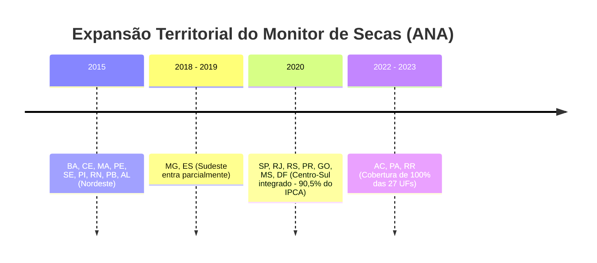

# 📘 Módulo 4: Tabela Fato Final, Semântica dos Nulos e Validações (Slides 11 a 13)

Este documento orienta o palestrante sobre como apresentar a arquitetura analítica das 108 colunas, defender a semântica rigorosa dos dados ausentes e demonstrar a robustez dos testes estruturais e empíricos.

---

## 📌 Slide 11 — A tabela final

### 1. Resumo Executivo e Mensagem Central
- **O Entregável Definitivo:** [`data/processed/fato_alimentos_combustiveis_uf_mes.parquet`](../../data/processed/fato_alimentos_combustiveis_uf_mes.parquet).
- **Dimensões:** **2.088 linhas × 108 colunas**, chave primária estritamente única `(sigla_uf, ano_mes)` com `ano_mes` em tipo nativo `Period[M]`.
- **Cobertura Espaço-Temporal:** 16 UFs representativas da inflação urbana ao longo de 138 meses (janeiro/2015 a junho/2026).
- **Consumo Computacional:** Arquivo binário colunar de apenas 981 KB em disco e **1,8 MB de RAM** quando carregado em memória — viabilizando treinamentos rápidos e leves em qualquer computador pessoal.
- **Transparência e Governança:** Dicionário de metadados cobrindo **100% das 108 colunas** ([`outputs/tabelas/dicionario_variaveis_combustiveis.csv`](../../outputs/tabelas/dicionario_variaveis_combustiveis.csv)), explicitando unidade de medida, órgão de origem, grão nativo, % de valores ausentes e justificativa semântica do vazio.

---

### 2. Decomposição das 108 Colunas por Famílias

| Família de Colunas | Quantidade | Fonte Primária | Exemplos Notáveis | Função Analítica no Modelo |
|---|:---:|---|---|---|
| `ipca_*` | **36** colunas | IBGE / SIDRA | `ipca_var_alimentacao`, `ipca_var_alimentacao_acum12`, `ipca_var_alimentacao_relativa`, `ipca_var_arroz`, `ipca_peso_carnes` | **Os três alvos de previsão** + 17 variações de preços e 17 pesos orçamentários desagregados. |
| `safra_*` | **22** colunas | IBGE / LSPA | `safra_producao_t_soja`, `safra_revisao_pct_milho`, `safra_revisao_pct_feijao` | Variáveis de choque de oferta (expectativa de colheita anual e revisão de estimativa mês a mês). |
| `comb_*` | **19** colunas | ANP | `comb_preco_diesel`, `comb_var_mm_diesel`, `comb_var12_diesel`, `comb_diesel_vs_br_pct`, `comb_observado_liquidos` | Variáveis de custo logístico rodoviário e assimetria espacial de frete regional. |
| `clima_*` | **11** colunas | INMET | `clima_chuva_mm_mes`, `clima_temp_media`, `clima_max_dias_secos_seguidos`, `clima_dias_calor_extremo`, `clima_n_estacoes` | Indicadores de extremos meteorológicos e variabilidade pluviométrica local. |
| `seca_*` | **9** colunas | ANA | `seca_severidade_media`, `seca_pct_area_S2plus`, `seca_meses_consecutivos_S2plus`, `seca_monitorado` | Intensidade e persistência de estresse hídrico no território estadual. |
| `macro_*` | **5** colunas | BCB / SGS | `macro_dolar_ptax_medio`, `macro_selic`, `macro_ipca_mm`, `macro_igpm` | Controles de perda do poder aquisitivo da moeda e taxas de juros nacionais. |
| *Descritivas* | **6** colunas | IBGE (`dim_uf`) | `sigla_uf`, `nome_uf`, `regiao`, `ano_mes`, `ano`, `mes` | Chaves primárias de painel, identificadores geográficos e efeitos sazonais fixos. |

---

## 📌 Slide 12 — Cada vazio significa uma coisa diferente

### 1. Resumo Executivo e Mensagem Central
- **A Tese Central:** Em Ciência de Dados do mundo real, um valor faltante (`NaN`) **nunca é apenas a ausência de um número; ele é uma afirmação factual sobre o mundo**.
- **O Risco da Imputação Ingênua:** Práticas comuns como preencher nulos com zero (`fillna(0)`) ou imputar pela média/mediana global sem análise semântica introduziriam vieses catastróficos nas conclusões causais do projeto.
- Cada família de variáveis possui uma ontologia própria de ausência, formalmente documentada no pipeline.

---

### 2. Taxonomia Semântica dos Dados Ausentes no Projeto

| Família | % de Nulos | O que o `NaN` Significa Factualmente | Por que NUNCA Preencher com 0? | Como o Pipeline Trata |
|---|:---:|---|---|---|
| **`seca_*`** | 34% a 38% | **A UF ainda não havia entrado no programa de monitoramento da ANA** naquele ano/mês. | Preencher com 0 ensinaria ao modelo que não havia seca no Sul/Sudeste antes de 2020. Faria o modelo correlacionar "seca" com o mero fato de "ser do Nordeste". | Criou-se a flag booleana `seca_monitorado`. O usuário deve filtrar por ela ou recortar a análise em $\ge$ 2020. |
| **`comb_preco_*` (líquidos)** | ~23% | **A ANP não realizou pesquisa de campo** naquele mês (33 dos 138 meses da janela). | Preencher com 0 faria o modelo registrar meses com postos de combustíveis distribuindo diesel e gasolina de graça. | Criou-se a flag `comb_observado_liquidos`. Sem observação, o preço é `NaN`. |
| **`comb_var12_*`** | ~39% | Efeito cumulativo: requer observação válida no mês $t$ **e** no mês $t-12$. | Não há base matemática para calcular variação anual quando falta uma das pontas. | Herança aritmética de nulos sobre a grade temporal regular. |
| **`safra_revisao_pct_*`** | 9% a 53% | **A revisão é matematicamente indefinida:** janeiro é a primeira estimativa do ano (sem base prévia), ou a UF não planta a cultura. | Zero significaria que a comissão técnica se reuniu e concluiu que a estimativa anterior estava 100% mantida. | Permanece `NaN` para refletir ausência de revisão. |
| **`safra_producao_t_*`** | **0%** | Não há nulos. | A grade UF × produto × mês é perfeita. A ausência de cultura virou **0,0 toneladas**, o que é a verdade fática da economia agrícola do estado. | `fillna(0.0)` legítimo aplicado exclusivamente na produção física. |
| **`clima_*`** | 0,3% | Nenhuma estação da UF atingiu o limiar de 70% de dias com medição válida no mês. | Zero milímetros de chuva simularia uma seca absoluta em um mês em que choveu mas o sensor falhou. | Preservado como `NaN`. |

#### Por que os percentuais têm intervalos tão amplos dentro da mesma família?
1. **Na Seca (`seca_*`: 34,29 % a 38,17 %):**
   - **Piso (34,29 % — 716 nulos):** Presente em `seca_severidade_media`, `pct_area_S0plus` a `S4plus` e `meses_consecutivos_S2plus`. Reflete estritamente os meses em que a UF **não era monitorada** pela ANA pré-2020.
   - **Teto (38,17 % — 797 nulos):** Ocorre em **`seca_severidade_media_area_seca`**. Esta métrica calcula a severidade dividindo pela área em seca. Em **81 meses monitorados**, a UF teve **zero seca** (tempo excelente, chuva abundante). A fração $\frac{0}{0}$ gera `NaN` condicional por definição matemática ($716 + 81 = 797$ nulos)!
2. **Na Revisão de Safra (`safra_revisao_pct_*`: 8,62 % a 52,68 %):**
   - A ausência é governada por: $\text{Taxa de Nulos} = \text{Janeiro (8,62 \%)} + \text{Inaptidão Agronômica da UF}$.
   - **Piso (8,62 % — 180 nulos):** Culturas universais como **milho, feijão e mandioca** (e cana com 9,05%), cultivadas em todas as 16 UFs, que nascem nulas **apenas em janeiro** (primeira estimativa do ano civil, sem base anterior de comparação).
   - **Teto (52,68 % — 1.100 nulos):** Culturas de clima temperado rigoroso como **trigo** (e batata-inglesa com 49,52%). No Brasil, **metade da amostra (8 UFs: AC, CE, ES, MA, PA, PE, RJ, SE) produz ZERO trigo**. Logo, essas 8 UFs têm 100% de meses nulos na revisão, somando-se aos janeiros dos estados produtores!

---

### 3. A Ilustração do Perigo da Seca: A Expansão Territorial da ANA

O Monitor de Secas da ANA não nasceu nacional:
- **2015-01:** Iniciado apenas nos 9 estados da Região Nordeste.
- **2018-2019:** Expansão para Minas Gerais e Espírito Santo.
- **2020:** Inclusão de São Paulo, Rio de Janeiro, Paraná, Rio Grande do Sul, Goiás, Mato Grosso do Sul e DF.
- **2022-2023:** Inclusão dos estados do Norte (Acre, Pará, Roraima).



> **Aviso da Equipe:** Um modelo descuidado treinado com `fillna(0)` no período 2015-2019 concluiria que São Paulo e Rio Grande do Sul têm "imunidade a secas" e que a seca "causa desemprego apenas na população nordestina", confundindo ausência de monitor com ausência do fenômeno físico!

---

## 📌 Slide 13 — Validação: estrutural primeiro, histórica depois

### 1. Resumo Executivo e Mensagem Central
- Um pipeline de dados em Ciência de Dados não pode ser considerado correto apenas porque "rodou sem dar erro".
- A equipe implementou um sistema duplo de validação:
  1. **Validação Estrutural (Sintática e de Schema):** Asserções rígidas inseridas no código que forçam o encerramento do processo caso invariantes lógicos sejam violados.
  2. **Validação Histórica (Empírica e Semântica):** Verificação de se a base final reconhece de forma puramente não-supervisionada os grandes choques econômicos e climáticos documentados na história recente do Brasil.

---

### 2. Pirâmide de Validações Estruturais em Código

Executadas ao final de [`src/tratamento/24_junta.py`](../../src/tratamento/24_junta.py#L407-L428) e [`src/tratamento/25_combustiveis.py`](../../src/tratamento/25_combustiveis.py#L359-L388):

```python
# 1. Integridade de Chave e Linhas
assert fato.duplicated(["sigla_uf", "ano_mes"]).sum() == 0, "Erro: Chave primária duplicada!"
assert len(fato) == 2088, f"Erro: Fan-out detectado! Total de linhas: {len(fato)}"
assert isinstance(fato["ano_mes"].dtype, pd.PeriodDtype), "Erro: ano_mes corrompido!"

# 2. Defesa contra o Bug do Sinal do IPCA
assert (fato["ipca_var_alimentacao"] < 0).sum() > 0, "Erro: Deflação ausente no alvo!"

# 3. Limites Físicos de Domínio
assert liquidos.between(1.0, 15.0).all(), "Erro: Preço de diesel/gasolina fora de 1 a 15 R$/l!"
assert fato["comb_preco_glp_13kg"].dropna().between(20.0, 200.0).all(), "Erro: GLP fora da faixa!"

# 4. Invariante Lógico de Observabilidade
assert fato.loc[~fato["comb_observado_liquidos"], colunas_liquidos].isna().all().all(), \
    "Erro: Mês não observado com preço de combustível preenchido!"
```

---

### 3. Validação Histórica: A Base Reconhece o Passado Sozinha

Sem que nenhuma anotação manual fosse feita, a tabela final capturou exatamente os eventos exógenos registrados no país:

1. **A Grande Seca do Ceará (Janeiro de 2017):**
   - Na tabela: O Ceará aparece com `seca_pct_area_S2plus = 100,0%`, `seca_pct_area_S4plus = 63,64%` (seca excepcional) e severidade média de **4,52 em 5,00**.
   - Fato Histórico: Foi o ápice da seca plurianual de 2012-2017 no semiárido, com colapso do reservatório Castanhão.
2. **O Choque de Inflação Alimentar da Pandemia (Novembro de 2020):**
   - Na tabela: `ipca_var_alimentacao_acum12` atinge **+18,1% ao ano** no consolidado nacional, puxado pelo subitem óleo de soja e arroz.
   - Fato Histórico: Combinação de desvalorização abrupta do real frente ao dólar com o aumento do consumo alimentar domiciliar impulsionado pelo Auxílio Emergencial.
3. **Sazonalidade Climática Física do Brasil:**
   - Na tabela: A chuva mediana na Região Norte e Centro-Oeste marca **226 mm em janeiro** e despenca para **13 mm em agosto**.
   - Fato Histórico: Regime monçônico da América do Sul fielmente refletido pela agregação climática.
4. **O Choque do Diesel e a Desoneração Tributária (2022–2023):**
   - Na tabela: `comb_var12_diesel` atinge pico histórico de **+62,1% em julho de 2022** e registra o vale deflacionário de **−33,8% em julho de 2023**.
   - Fato Histórico: O pico reflete o choque de oferta global pós-invasão russa da Ucrânia em 2022; o vale reflete a aprovação da Lei Complementar 194/2022 (teto de ICMS) e a normalização dos preços internacionais do barril de petróleo Brent em 2023.

---

### 4. Perguntas Prováveis da Banca e Respostas Afiadas

> **Pergunta da Banca:** *"Se o Monitor de Secas tinha mais de 30% de nulos, não seria melhor ter descartado essa fonte e ficado apenas com a chuva do INMET?"*  
> **Resposta do Palestrante:**  
> "Descartar o Monitor de Secas seria empobrecer severamente a informação agronômica do projeto. A precipitação do INMET mede apenas a oferta de água atmosférica em milímetros pontuais. O Monitor de Secas da ANA integra múltiplos índices climáticos (SPI, SPEI) com sensoriamento remoto de índice de vegetação (NDVI) e disponibilidade hídrica no solo. O dado da ANA mede o **estresse hídrico acumulado na biomassa**. Além disso, para a janela de maior interesse analítico contemporâneo ($\ge$ 2020), o Monitor cobre mais de 90,5% das linhas do nosso alvo."
