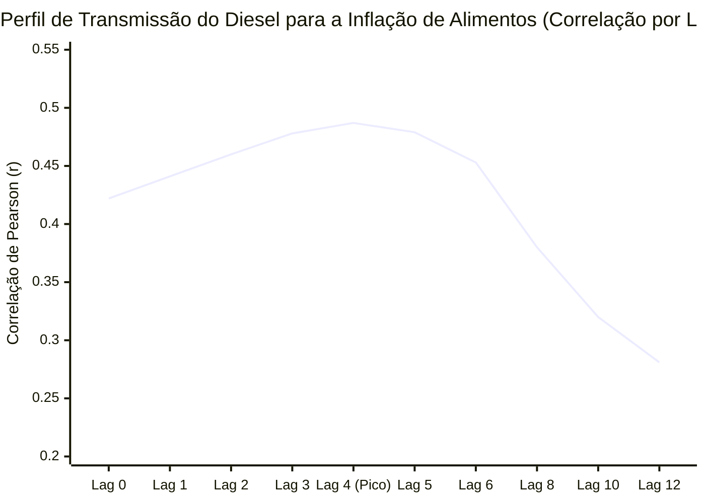
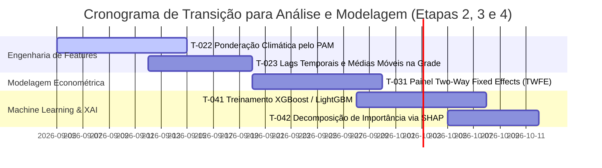

# 📘 Módulo 5: Achados Empíricos, Limites Epistemológicos e Próximos Passos (Slides 14 e 15)

Este documento capacita o palestrante a encerrar a apresentação com alto impacto técnico, apresentando os achados econométricos não-óbvios resultantes da integração, delimitando o escopo legítimo de uso da base e delineando o plano de modelagem analítica.

---

## 📌 Slide 14 — O achado que justifica a última fonte existir

### 1. Resumo Executivo e Mensagem Central
- Uma pergunta inevitável de qualquer banca é: *"Por que vocês adicionaram uma sexta fonte de combustíveis (ANP) se a disciplina exigia apenas três e o tema é alimentos?"*
- A resposta é empírica e irrefutável: a integração do combustível revelou **dois sinais estatísticos essenciais que não existiam em nenhuma das outras fontes isoladas**:
  1. **O Sinal Temporal de Repasse de Custos:** A curva de correlação cruzada (*cross-correlation lag profile*) atinge seu pico exatamente aos **4 meses de defasagem** entre o diesel e a inflação alimentar.
  2. **O Sinal Espacial de Assimetria Logística:** A distância e as barreiras de infraestrutura geram um desvio estrutural permanente de custo (o Acre paga +20,3% acima da mediana do país em todo mês da série), dimensão para a qual as variáveis macroeconômicas nacionais são cegas.

---

### 2. O Perfil de Defasagem Temporal (*Lag Profile*)

A equipe analisou a correlação linear entre a variação anual do preço do diesel (`comb_var12_diesel`) defasada em $k$ meses e a inflação acumulada de alimentos em 12 meses (`ipca_var_alimentacao_acum12`):

$$\text{Corr}\left(\text{Diesel}_{t-k}, \text{IPCA Alimentos}_t\right)$$

| Defasagem ($k$ meses) | Coeficiente de Correlação ($r$) | Interpretação Econômica |
|:---:|:---:|---|
| **$k = 0$ (Contemporâneo)** | 0,422 | Efeito imediato modesto nas bombas de postos urbanos. |
| **$k = 1$ mês** | 0,441 | Início do repasse nos fretes intermunicipais de cargas perecíveis. |
| **$k = 2$ meses** | 0,460 | Repasse nos contratos atacadistas das Centrais de Abastecimento (CEASAs). |
| **$k = 3$ meses** | 0,478 | Repasse à indústria de processamento e moagem (farinhas, óleos, carnes). |
| **$k = 4$ meses** | **0,487 (Pico)** | **Ponto máximo de transmissão: o choque de frete atinge as prateleiras dos supermercados urbanos.** |
| **$k = 5$ meses** | 0,479 | Início da dissipação do choque de custos. |
| **$k = 6$ meses** | 0,453 | Absorção pelas margens do varejo e desaceleração do efeito. |
| **$k = 12$ meses** | 0,281 | Diluição macroeconômica de longo prazo. |

> **Significado Econômico para a Banca:**  
> A existência de uma curva com formato de sino assimétrico e pico definido em 4 meses afasta a hipótese de correlação espúria contemporânea. Ela reflete a física da cadeia logística brasileira: o caminhoneiro compra diesel mais caro na época do plantio/colheita, repassa ao frete rodoviário, a distribuidora repassa ao supermercadista e o consumidor final sente o aumento pleno no 4º mês.

---

### 3. A Dimensão Espacial que o Banco Central Não Enxerga

A variável `macro_dolar_ptax_medio` é nacional: em março de 2021, o dólar foi de R$ 5,65 tanto para um cidadão em Curitiba quanto para um cidadão em Rio Branco. O câmbio e a taxa Selic **têm variância zero no corte transversal entre estados**.

Para capturar a assimetria geográfica, calculou-se o desvio relativo contra a mediana nacional do mês ([`src/tratamento/25_combustiveis.py:187-189`](../../src/tratamento/25_combustiveis.py#L187-L189)):
$$\text{comb\_diesel\_vs\_br\_pct}_{i, t} = \left( \frac{\text{Preço Diesel}_{i, t}}{\text{Mediana Nacional Diesel}_t} - 1 \right) \times 100$$

#### Dispersão Espacial Média por UF:
| Estado (UF) | Desvio Médio contra o Brasil | Realidade Logística e Estrutural |
|:---:|:---:|---|
| **Acre (AC)** | **+20,3 %** | Extremo isolamento geográfico, dependência de transporte por balsa e trechos não pavimentados da BR-364, ausência de refinarias locais. Paga 20% a mais pelo frete em todo mês da história! |
| **Pará (PA)** | **+7,1 %** | Grandes distâncias fluviais e custos de cabotagem na Amazônia Oriental. |
| **Ceará (CE)** | **+3,2 %** | Dependência de frete marítimo e suprimento via Porto do Pecém. |
| **Mato Grosso do Sul (MS)** | **+2,2 %** | Distância intermediária em relação aos polos de refino do Sudeste. |
| **São Paulo (SP)** | **−2,7 %** | Maior malha de refinarias do país (REPLAN, REVAP, RECAP) e dutos diretos. |
| **Paraná (PR)** | **−4,7 %** | Proximidade imediata da Refinaria Presidente Getúlio Vargas (REPAR) em Araucária. |

---

## 📌 Slide 15 — Limites de uso e próximos passos

### 1. Resumo Executivo e Mensagem Central
- Uma equipe madura em Ciência de Dados não apenas celebra os pontos fortes de seu dataset, mas **conhece e declara explicitamente os limites de validade de suas variáveis**.
- Apresentar com transparência o que a base **pode** e o que ela **não pode** responder é o maior demonstrativo de integridade acadêmica perante o Prof. Alexandre Delbem e a banca.

---

### 2. Matriz de Limites Epistemológicos de Uso da Tabela

| ✅ O Que a Base Permite Fazer com Rigor | ❌ O Que a Base NUNCA Permite Fazer (Viés Metodológico) | Racional Técnico e Teórico |
|---|---|---|
| Modelar o repasse de frete com o diesel defasado em 4 a 5 meses. | Ler `NaN` de combustíveis como "preço zero" ou produto gratuito. | Os 33 meses sem líquidos decorrem de falha na extração da ANP; imputar zero geraria preços fictícios de mercado livre. |
| Comparar a variação de um subitem (ex: arroz) com o grupo de alimentos na mesma UF. | **Somar os pesos `ipca_peso_*` entre colunas.** | Os 17 itens selecionados misturam de propósito níveis da hierarquia do IBGE (o subitem Arroz está dentro do grupo Alimentação). Somar duplicaria o orçamento familiar. |
| Explicar por que a inflação de alimentos no Acre é mais volátil que em São Paulo usando custos de combustível. | Tentar explicar diferenças regionais entre estados usando as colunas `macro_*` (dólar, juros, IGP-M). | As variáveis do Banco Central são idênticas para todas as 16 UFs no mesmo mês; sua variância inter-estadual é zero. |
| Utilizar a variável `safra_revisao_pct_*` como choque mensal de oferta agrícola. | **Somar os valores de `safra_producao_t_*` ao longo dos 12 meses do ano.** | Cada linha do LSPA representa a estimativa da colheita do **ano inteiro** vigente naquele mês (estoque de previsão, não fluxo). Somar 12 meses inflaria a produção em 12 vezes! |
| Analisar a evolução temporal do clima dentro da mesma UF ao longo dos anos. | Comparar o nível absoluto de clima entre duas UFs sem controlar pela coluna `clima_n_estacoes`. | O número de estações ativas varia entre 1 (Roraima) e 77 estações (Minas Gerais). Um salto de nível pode ser artefato da expansão da rede do INMET, não alteração meteorológica. |

---

### 3. Roadmap Técnico: O Que Vem nas Próximas Etapas

1. **Ticket T-022 (Ponderação Espacial do Clima pela Produção Agrícola):**
   - Substituir a mediana espacial simples da UF por uma média ponderada das estações meteorológicas, utilizando a produção agrícola dos municípios circunvizinhos apurada pela PAM (Pesquisa Agrícola Municipal).
   - O arquivo [`data/interim/producao_uf_ano.parquet`](../../data/interim/producao_uf_ano.parquet) já possui os pesos municipais calculados.
2. **Ticket T-023 (Engenharia de Lags Temporais na Grade):**
   - Gerar defasagens de 1 a 6 meses para chuva acumulada (`clima_chuva_acum_3m`), contagem de ondas de calor e defasagens do diesel (`comb_diesel_lag1..lag4`).
   - Os cálculos serão efetuados sobre o calendário cartesiano completo para evitar perda de bordas.
3. **Modelagem Econométrica em Painel (TWFE - Two-Way Fixed Effects):**
   $$\Delta \text{IPCA}_{i, t} = \alpha_i + \gamma_t + \beta_1 \text{Clima}_{i, t} + \beta_2 \text{Diesel}_{i, t-4} + \beta_3 \text{Safra}_{i, t} + \epsilon_{i, t}$$
   Permite controlar por características fixas não-observadas de cada estado ($\alpha_i$) e choques macroeconômicos comuns no tempo ($\gamma_t$).
4. **Machine Learning e Explicabilidade com SHAP Values:**
   - Modelos de Gradient Boosting (XGBoost) para capturar interações não-lineares entre secas severas e alta simultânea de frete.
   - Cálculo de valores SHAP (*SHapley Additive exPlanations*) para responder quantitativamente à pergunta da Capa: **qual é o peso percentual relativo do Clima vs. Custo de Frete vs. Choque Cambial na inflação da comida brasileira.**

---

### 4. A Mensagem Final de Fechamento do Palestrante

> *"Senhores professores e membros da banca: dos seis merges executados para construir esta tabela, três falhariam silenciosamente se fossem escritos pela abordagem ingênua do dia a dia — um retornaria uma tabela inteira de valores vazios sem acusar erro, um multiplicaria as linhas por onze inflando os dados, e outro inventaria uma falsa taxa de inflação mensal comparando meses com quatro meses de distância.*  
> *O mérito desta entrega não foi simplesmente executar scripts em Python, mas construir uma arquitetura com verificações defensivas rigorosas que transformam o erro silencioso em exceção audível e garantem que cada um dos 2.088 registros reflita a realidade física e econômica do nosso país."*
