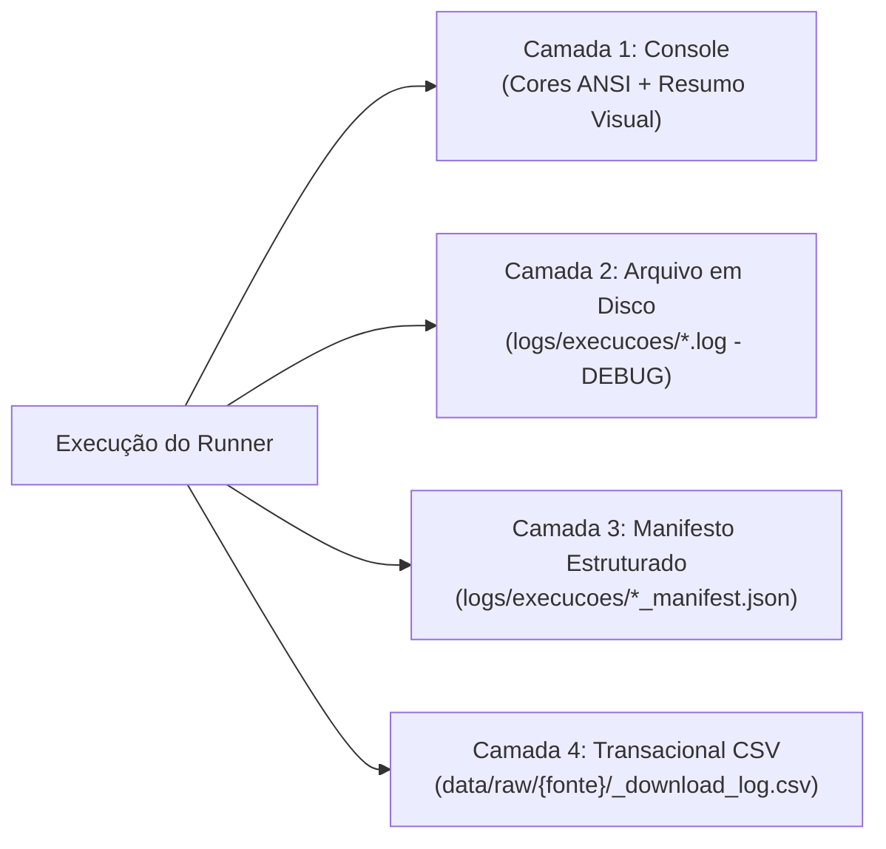

# 🛠️ Guia do Desenvolvedor & Manual de Arquitetura

**Projeto:** SSC0957 — Prática em Ciência de Dados II (2026)  
**Tema:** Crises Climáticas e Alimentares no Cenário Brasileiro  
**Público-alvo:** Desenvolvedores, cientistas de dados e revisores do projeto  

---

## 1. Princípios de Engenharia de Software Adotados

O projeto foi construído sobre quatro pilares fundamentais para permitir o trabalho colaborativo sem atritos:

1. **Idempotência Operacional:** Executar qualquer coletor ou orquestrador repetidas vezes produz o mesmo resultado sem reprocessamentos caros ou chamadas de rede desnecessárias.
2. **Reprodutibilidade Total:** Qualquer membro da equipe ou ambiente de integração contínua (CI) pode clonar o repositório e gerar todas as bases locais com um único comando (`python -m src.coleta.runner --completo`).
3. **Tolerância a Falhas e Segurança em Disco:** Nenhuma operação sobrescreve dados de forma destrutiva sem salvaguarda. Em caso de interrupção ou falha no processamento, cópias de segurança com timestamp são ativadas e o sistema realiza **rollback automático**.
4. **Contratos Explícitos e Tipagem Estática:** Todos os coletores e etapas de tratamento compartilham interfaces uniformes e dataclasses tipadas (`ColetaResult`).

---

## 2. Ciclo de Vida e Estrutura de Dados (`data/`)

Adotamos a arquitetura de camadas de dados consagrada na engenharia de dados:

```text
data/
├── raw/         # Dados brutos imutáveis (exatamente como chegam das APIs/fontes)
├── interim/     # Tabelas intermediárias limpas, tratadas e normalizadas por fonte
└── processed/   # Tabelas modeladas finais (dimensões e tabelas fatos unificadas)
```

| Camada | Regra de Ouro | Formatos Usados |
|---|---|:---:|
| **`data/raw/`** | **NUNCA modificar manualmente.** Dados brutos baixados (ex: ZIPs do INMET, JSONs da ANA, CSV da ANP). | `.parquet`, `.csv`, `.zip`, `.txt` |
| **`data/interim/`** | **Tabelas geradas por fonte.** Dados limpos, sem duplicatas, com chaves canônicas (`sigla_uf`, `ano_mes`), prontos para junção. | `.parquet`, `.csv` |
| **`data/processed/`** | **Consumo analítico e modelagem.** Tabela-dimensão territorial canônica (`dim_uf.csv`), calendário e tabelas fatos consolidadas. | `.parquet`, `.csv` |

---

## 3. Governança do Git e Dados (`.gitignore`)

> [!IMPORTANT]
> **Dados binários pesados (`.parquet`, `.zip`, etc.) NUNCA devem ser versionados no Git.**

### Por que adotamos essa política?
- **Evitar inchaço do repositório (`.git`):** O Git versiona diffs linha a linha de arquivos textuais. Arquivos binários colunares como `.parquet` gravam um snapshot novo de dezenas de megabytes a cada commit, inflando o repositório em poucos dias.
- **Prevenção de conflitos de merge binários:** Dois membros gerando a mesma base produzirão timestamps e checksums binários diferentes, gerando conflitos impossíveis de resolver no Git.
- **Preservação local:** O `.gitignore` foi configurado para ignorar os dados no Git sem apagar nenhum arquivo do seu disco local.

### O que fica no Git vs. O que é gerado localmente:
- ✅ **Versionado no Git:** Código-fonte (`src/`), testes (`tests/`), documentações (`docs/`, `.md`), notebooks (`notebooks/`), a tabela-dimensão canônica ([`data/processed/dim_uf.csv`](file:///home/gabyl/projetos/trabalho_pcd2/data/processed/dim_uf.csv)) e arquivos `.gitkeep`.
- ❌ **Ignorado pelo Git (gerado pelo orquestrador):** Arquivos em `data/raw/*`, `data/interim/*`, `data/processed/*.parquet`, `logs/` e arquivos de backup `*.bak`.

---

## 4. O Orquestrador Central de Execução (`src/coleta/runner.py`)

O orquestrador é o ponto único de entrada para ingestão, auditoria e tratamento de dados.

### Modos de Execução da CLI:

#### 1. Diagnóstico e Auditoria em Disco (Dry-Run)
Verifica o preenchimento, número de linhas, colunas, tamanho e integridade de todas as **15 bases locais** sem fazer chamadas de rede:
```bash
python -m src.coleta.runner --status
```

#### 2. Ingestão / Coleta Segura (Padrão: Reutiliza o que já existe)
```bash
python -m src.coleta.runner --all                       # Todas as 6 fontes
python -m src.coleta.runner --fonte ipca                # Apenas IPCA Alimentos
python -m src.coleta.runner --fonte inmet               # Apenas Clima INMET
python -m src.coleta.runner --fonte seca                # Apenas Monitor de Secas ANA
python -m src.coleta.runner --fonte safra               # Apenas Safra LSPA/PAM
python -m src.coleta.runner --fonte bcb                 # Apenas Macroeconômico BCB
python -m src.coleta.runner --fonte combustiveis        # Apenas Preços de Combustíveis ANP
python -m src.coleta.runner --fontes ipca,bcb,combustiveis # Subconjunto escolhido
```

#### 3. Pipeline de Tratamento e Junção Final (Etapa 2)
Executa a agregação espacial climática (`21_clima_uf_mes`), a junção central das 5 fontes (`24_junta`) e a integração da família de combustíveis (`25_combustiveis`):
```bash
python -m src.coleta.runner --tratamento
```

#### 4. Esteira Completa End-to-End
Baixa/atualiza tudo e gera as tabelas fatos finais em sequência:
```bash
python -m src.coleta.runner --completo
```

#### 5. Políticas de Sobrescrita Granular (`--overwrite`)
| Opção | Comportamento |
|---|---|
| `--overwrite skip` *(Padrão)* | Verifica integridade e reutiliza arquivos existentes sem rede (~0.1s para todas as bases). |
| `--force` ou `-f` | Força re-download e substituição integral, descartando checkpoints locais. |
| `--update` ou `-u` | Atualização incremental (preserva dados passados e requisita apenas meses novos). |
| `--backup` ou `-b` | Cria cópia com timestamp (`.bak_YYYYMMDD_HHMMSS`) antes de atualizar, com rollback automático em caso de erro. |
| `--interactive` ou `-i` | Solicita confirmação no terminal antes de sobrescrever arquivos locais. |

---

## 5. Arquitetura de Logging e Auditoria em 4 Camadas

Implementada em [`src/logging_config.py`](file:///home/gabyl/projetos/trabalho_pcd2/src/logging_config.py):



1. **Camada 1 (Console/Terminal):** Feedback limpo e imediato com badges coloridos (`[INFO]`, `[AVISO]`, `[ERRO]`, `[SUCESSO]`) e tabela ASCII final com contadores exatos.
2. **Camada 2 (Arquivo de Log DEBUG):** Gravado em `logs/execucoes/coleta_YYYYMMDD_HHMMSS.log` com timestamps precisos em milissegundos, logger de origem, função e linha exata de cada evento ou rastreamento de exceção.
3. **Camada 3 (Manifesto JSON):** Gravado em `logs/execucoes/coleta_YYYYMMDD_HHMMSS_manifest.json` com metadados estruturados de cada módulo (linhas, colunas, duração, chunks totais, reaproveitados e status geral).
4. **Camada 4 (Log Transacional CSV):** Gravado em `data/raw/{fonte}/_download_log.csv` mantendo histórico de cada requisição HTTP/chunk com código de status, duração em ms, bytes e número de retentativas.

---

## 6. Gestão de Backups e Rollback Automático (`BackupManager`)

Para evitar arquivos parciais corrompidos caso uma requisição de rede ou processamento caia no meio do caminho, todas as gravações usam o context manager de segurança:

```python
from src.logging_config import BackupManager

with BackupManager.gerenciar_com_seguranca(arquivo_destino, ativar_backup=True, logger=log):
    # Processa os dados
    df.to_parquet(arquivo_destino, index=False)
    # Se qualquer exceção for lançada dentro deste bloco, o BackupManager
    # restaura automaticamente a versão anterior estável do arquivo!
```

---

## 7. Como Criar um Novo Coletor

Para plugar uma nova fonte de dados no orquestrador:

1. Crie o pacote em `src/coleta/<nome_da_fonte>/`.
2. Implemente a função de entrada respeitando o contrato padrão:
   ```python
   def executar_coleta(
       overwrite: str = "skip",
       ano_inicio: int | None = None,
       ano_fim: int | None = None,
       logger: logging.Logger | None = None,
       download_logger: DownloadLogger | None = None,
       interativo: bool = False,
   ) -> ColetaResult:
       ...
       return ColetaResult(
           fonte="nome_da_fonte",
           status="SUCESSO",
           acao_executada="BAIXADO_NOVO",
           duracao_segundos=duracao,
           linhas=len(df),
           colunas=df.shape[1],
           arquivo_saida="data/interim/arquivo.parquet",
           tamanho_bytes=tamanho,
       )
   ```
3. Exporte a função em `src/coleta/<nome_da_fonte>/__init__.py`.
4. Registre a fonte no catálogo `COLETORES` e na lista `ORDEM_EXECUCAO_PADRAO` em [`src/coleta/runner.py`](file:///home/gabyl/projetos/trabalho_pcd2/src/coleta/runner.py).

---

## 8. Pipeline de Tratamento e Junção Final (`src/tratamento/`)

A esteira de tratamento transforma as tabelas isoladas da camada `interim` nas tabelas modeladas de `processed`:

1. **[`src/tratamento/21_clima_uf_mes.py`](file:///home/gabyl/projetos/trabalho_pcd2/src/tratamento/21_clima_uf_mes.py):**
   - Reduz 701 estações meteorológicas para a grade UF × mês.
   - Aplica corte de qualidade (estações com < 70% de dias válidos no mês viram `NaN` antes da agregação).
   - Agrega por **mediana** (e nunca média) para imunidade a sensores defeituosos.
2. **[`src/tratamento/24_junta.py`](file:///home/gabyl/projetos/trabalho_pcd2/src/tratamento/24_junta.py):**
   - Cria o calendário completo (27 UFs × 138 meses = 3.726 linhas) como espinha dorsal.
   - Realiza `LEFT JOIN` com validação estrita (`checa_join`) das 5 fontes (IPCA, Clima UF, Safra, Seca, Macro).
   - Gera [`data/processed/fato_alimentos_uf_mes.parquet`](file:///home/gabyl/projetos/trabalho_pcd2/data/processed/fato_alimentos_uf_mes.parquet) (2.088 linhas com alvo IPCA × 89 colunas).
   - Gera o dicionário de variáveis documentado em [`outputs/tabelas/dicionario_variaveis.csv`](file:///home/gabyl/projetos/trabalho_pcd2/outputs/tabelas/dicionario_variaveis.csv).
3. **[`src/tratamento/25_combustiveis.py`](file:///home/gabyl/projetos/trabalho_pcd2/src/tratamento/25_combustiveis.py):**
   - Pondera preços de combustíveis da ANP pelo volume de postos pesquisados.
   - Integra as variáveis de frete e choque energético à tabela fato.
   - Gera [`data/processed/fato_alimentos_combustiveis_uf_mes.parquet`](file:///home/gabyl/projetos/trabalho_pcd2/data/processed/fato_alimentos_combustiveis_uf_mes.parquet) (2.088 linhas × 108 colunas).
   - Gera o dicionário de variáveis documentado em [`outputs/tabelas/dicionario_variaveis_combustiveis.csv`](file:///home/gabyl/projetos/trabalho_pcd2/outputs/tabelas/dicionario_variaveis_combustiveis.csv).

---

## 9. Testes Automatizados

O projeto possui suíte de testes unitários em [`tests/`](file:///home/gabyl/projetos/trabalho_pcd2/tests/):

```bash
# Executa todos os testes unitários e de integração
python -m unittest discover -s tests -v
```

- [`tests/test_logging_and_backup.py`](file:///home/gabyl/projetos/trabalho_pcd2/tests/test_logging_and_backup.py): Valida formatação ANSI, atomicidade do CSV transacional, manifestos JSON e rollback do `BackupManager`.
- [`tests/test_runner_cli.py`](file:///home/gabyl/projetos/trabalho_pcd2/tests/test_runner_cli.py): Valida parsing de flags CLI, resolução de nomes/aliases de fontes e auditoria de integridade do disco.
