# 🕒 Linha do Tempo das Decisões do Projeto

> Cronologia horizontal das decisões tomadas entre **06/08/2026** e **17/09/2026**.
> A **linha central** é o caminho efetivamente seguido; a **faixa superior** traz as opções que
> foram avaliadas e **descartadas** em cada ponto; a **faixa inferior**, o que ficou para depois.
>
> Fontes: histórico de commits, [`Decisões e Justificativas do Projeto`](../Grupo1-Obsidian/Projeto%20Grupo%201%20-%20Preço%20dos%20Alimentos/00%20-%20Visão%20Geral/Decisões%20e%20Justificativas%20do%20Projeto.md),
> [`analise_juncao_uf_mes.md`](analises/analise_juncao_uf_mes.md), [`analise_cobertura_safra_mt.md`](analises/analise_cobertura_safra_mt.md)
> e [`roteiro_simplificado.md`](apresentacao/roteiro_simplificado.md).

```mermaid
flowchart LR
    classDef marco fill:#e8f5e9,stroke:#2e7d32,stroke-width:3px,color:#1b5e20
    classDef fora fill:#ffebee,stroke:#c62828,stroke-width:1.5px,color:#b71c1c,stroke-dasharray: 4 3
    classDef futuro fill:#eceff1,stroke:#607d8b,stroke-width:1.5px,color:#263238,stroke-dasharray: 5 4

    %% ================= FAIXA SUPERIOR — o que NÃO fizemos =================
    X1["<b>Tema global</b><br/>ondas de calor na Europa<br/>El Niño na economia mundial"]:::fora
    X2["<b>DIEESE — cesta básica</b><br/>parser de PDF era o gargalo T-011<br/>preço em R$ por produto"]:::fora
    X3["<b>CONAB</b><br/>safra anual: viola a análise mensal<br/>e é redundante com o LSPA"]:::fora
    X4["<b>Média simples entre estações</b><br/>sensível a sensor defeituoso<br/>e somar chuva entre estações"]:::fora
    X5["<b>INNER JOIN direto</b><br/>perde linha em silêncio e<br/>multiplica a safra por 11"]:::fora
    X6["<b>Preencher NaN com 0</b><br/>e imputação por KNN/MICE<br/>inventaria ausência de seca"]:::fora
    X7["<b>Seca como regressor em toda a série</b><br/>só 65,8% de cobertura em 2015+<br/>confundiria seca com ser do Nordeste"]:::fora

    %% ================= LINHA CENTRAL — a cronologia =================
    P1["<b>06/08 · Fundação</b><br/>———————<br/>D1 · tema: clima × comida <b>no Brasil</b><br/>D2 · pergunta: volatilidade <b>regional</b><br/>D3 · medalhão raw → interim → processed"]:::marco
    P2["<b>13/08 · Backlog</b><br/>———————<br/>D4 · tickets T-001 → T-051<br/>D5 · explorar 7 fontes candidatas<br/>D6 · 5 hipóteses formais H1–H5"]:::marco
    P3["<b>20/08 · Alvo e grão</b><br/>———————<br/>D7 · alvo = <b>IPCA Alimentos/SIDRA</b><br/>D8 · grão comum = <b>UF × mês</b>, largo"]:::marco
    P4["<b>27/08 · Bases definidas</b><br/>———————<br/>D9 · manter IPCA · INMET · LSPA · BCB<br/>D10 · ANA/Secas: uso <b>parcial</b><br/>D11 · incluir <b>ANP</b>: frete + GLP<br/>D12 · orquestrador idempotente"]:::marco
    P5["<b>27/08 → 03/09 · Contrato de junção</b><br/>———————<br/>D13 · bloqueador: sinal do IPCA → re-coletar<br/>D14 · contrato de chaves + checa_join<br/>D15 · clima por <b>mediana</b>, corte de 70%<br/>D16 · safra: o sinal é a <b>revisão %</b><br/>D17 · espinha de calendário, <b>LEFT sempre</b><br/>D18 · macro por broadcast nacional<br/>D19 · ANP numa 2ª junção, ponderada<br/>D20 · nenhum vazio vira 0"]:::marco
    P6["<b>03/09 · Consolidação</b><br/>———————<br/>D21 · 2015-01 → 2026-06 · 16 UFs<br/>2.088 linhas × 108 colunas<br/>D22 · seca só a partir de <b>2020</b><br/>D23 · MT: broadcast de safra nacional<br/>D24 · docs em camadas + dicionário 100%"]:::marco
    P7["<b>17/09 · Hoje</b><br/>———————<br/>D25 · notebook de junção<br/>como prova executável"]:::marco

    P1 ==> P2 ==> P3 ==> P4 ==> P5 ==> P6 ==> P7

    %% ================= FAIXA INFERIOR — adiado =================
    N1["<b>T-022</b> clima ponderado pela produção"]:::futuro
    N2["<b>T-023</b> lags de chuva e seca · médias móveis"]:::futuro
    N3["<b>T-040/041/042</b> clustering · supervisionado · SHAP"]:::futuro

    %% ================= LIGAÇÕES =================
    X1 -.->|"descartado em"| P1
    X2 -.->|"abandonado em"| P3
    X3 -.->|"descartada em"| P4
    X4 -.->|"recusada em"| P5
    X5 -.->|"recusado em"| P5
    X6 -.->|"recusado em"| P5
    X7 -.->|"recusada em"| P6

    P7 -.-> N1
    P7 -.-> N2
    P7 -.-> N3
```

## Como ler

| Elemento | Significado |
|---|---|
| ➡️ Linha verde grossa | A cronologia efetiva: cada caixa é uma data e as decisões tomadas nela |
| 🟥 Caixas tracejadas **acima** | Opções avaliadas e **descartadas** — entram pela lateral, nunca na linha |
| ⬜ Caixas tracejadas **abaixo** | Decisões **ainda não tomadas**, adiadas para as próximas etapas |
| `D1 … D25` | Numeração sequencial das decisões, na ordem em que foram tomadas |
