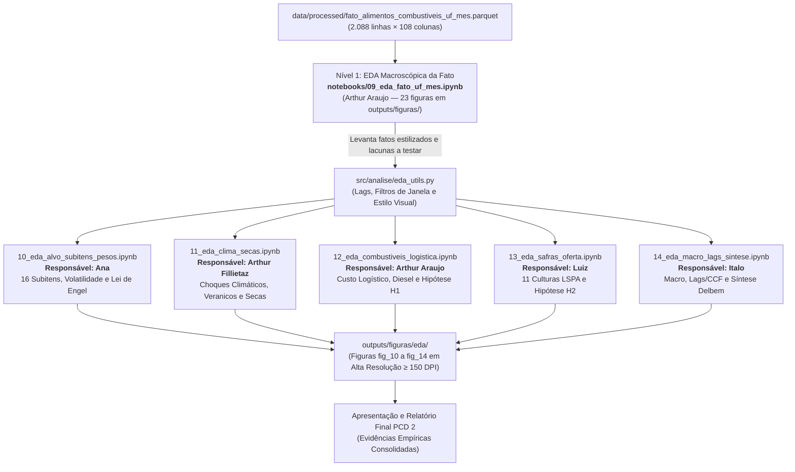

# Plano de Execução da EDA: O que move o preço da comida no Brasil?
**Base de Dados:** [`data/processed/fato_alimentos_combustiveis_uf_mes.parquet`](../../data/processed/fato_alimentos_combustiveis_uf_mes.parquet) (2.088 linhas, 108 colunas, 16 UFs, 2015-01 a 2026-06)  
**Disciplina:** SSC0957 — Prática em Ciência de Dados II (Prof. Alexandre Delbem — USP)  
**Equipe (5 pessoas):** Ana, Arthur Araujo, Arthur Fillietaz, Italo, Luiz  
**Horizonte:** 01/10 (quinta-feira) a 08/10 (quinta-feira) — com checkpoint intermediário em 05/10 (segunda-feira)

---

## 1. Visão Geral e Arquitetura em Dois Níveis

A etapa de Engenharia de Dados foi consolidada no notebook [`notebooks/08_decisoes_e_resultado_da_juncao.ipynb`](../../notebooks/08_decisoes_e_resultado_da_juncao.ipynb). A partir da tabela fato com 108 colunas, o trabalho de Análise Exploratória de Dados (EDA) é estruturado em **dois níveis complementares**:

### Nível 1: EDA Geral da Fato ([`notebooks/09_eda_fato_uf_mes.ipynb`](../../notebooks/09_eda_fato_uf_mes.ipynb))
Desenvolvida por **Arthur Araujo**, faz uma varredura horizontal de todas as 108 colunas e estabelece 6 achados empíricos fundamentais (com 23 figuras salvas em `outputs/figuras/`):
1. **Alvo predominantemente nacional:** O mês comum explica 73% da variância mensal, enquanto a UF isolada explica apenas 0,1%.
2. **Rankings móveis:** A diferença entre UFs não é constante ($\rho = -0,11$ entre as posições de 2018–22 e 2022–26).
3. **Divergência nos choques:** As UFs se afastam exatamente durante episódios de pico ($\rho = 0,71$ entre dispersão e inflação).
4. **Assimetria de choques:** 88 meses de choque catalogados (73 de alta vs. 15 de queda).
5. **Sazonalidade forte:** Forte correlação contemporânea entre chuva e preço nos meses de verão.
6. **Preços amplos dominam o contemporâneo:** Combustíveis correlacionam muito mais no mesmo mês do que clima e safra locais ($r \approx 0$).

### Nível 2: EDAs Temáticas de Aprofundamento e Testes de Hipóteses
O papel dos cadernos temáticos (10 a 14) é **auditar, checar a coerência e aprofundar** as conclusões do Nível 1, investigando se os fatos macroscópicos se confirmam quando abrimos os dados em subitens específicos, defasagens temporais (lags) e recortes regionais.

### Princípios Inegociáveis da Análise
1. **Estratégia de Janela Dupla:**
   - **Janela Ampla (2015–2026):** Para séries temporais e sazonalidade univariada, justificando vazios com flags (`seca_monitorado`, `comb_observado_liquidos`).
   - **Janela Balanceada:** Para correlações multivariadas onde todas as fontes precisam estar ativas simultaneamente.
2. **Template Obrigatório de 5 Seções em Cada Notebook Temático:**
   - **Seção 0: Auditoria e Confronto com a EDA Geral (Notebook 09):** Citação do achado macroscópico do Arthur e pergunta norteadora de teste.
   - **Seção 1: Comportamento Principal & Sazonalidade** (critério Delbem: tendência, ciclos).
   - **Seção 2: Padrões em Extremos & Caudas** (critério Delbem: P10/P90, anomalias).
   - **Seção 3: Casos Especiais & Quebras Estruturais** (critério Delbem: Greve 2018, Covid 2020, Seca 2021, Diesel 2022, Café 2024-25).
   - **Seção 4: Representatividade Espacial por Propósito** (critério Delbem: limitações das 16 UFs e heterogeneidade regional).
3. **Módulo Utilitário Compartilhado (`src/analise/eda_utils.py`):**
   Cálculo centralizado de lags agrupados por UF e estilização gráfica padronizada.
4. **Padronização Visual:**
   Figuras temáticas salvas em `outputs/figuras/eda/` com resolução $\ge 150\text{ DPI}$, rótulos de eixos com unidades explícitas.

---

## 2. Detalhamento dos 5 Cadernos Temáticos (Nível 2)

### Frente 1: Subitens da Cesta, Volatilidade e Lei de Engel
* **Responsável:** **Ana**
* **Notebook:** [`notebooks/10_eda_alvo_subitens_pesos.ipynb`](../../notebooks/10_eda_alvo_subitens_pesos.ipynb)
* **Confronto com o Notebook 09:** O notebook 09 constatou que 73% da variância do índice geral é explicada pelo mês nacional. A auditoria deve checar: essa sincronia nacional se sustenta para os 16 itens individuais, ou produtos perecíveis (tomate, hortaliças, batata, leite) apresentam dinâmica puramente regional?
* **Colunas Foco:** `ipca_var_alimentacao`, `ipca_var_alimentacao_acum12`, `ipca_var_alimentacao_relativa`, e as 16 variações e pesos de subitens (`ipca_var_arroz`, `ipca_peso_arroz`, etc.).
* **Perguntas a Responder:**
  1. A inflação de alimentos é generalizada ou puxada por vilões específicos em momentos distintos?
  2. Como a Lei de Engel e os pesos da POF amplificam o impacto social da inflação no Norte/Nordeste em relação ao Sul/Sudeste?
  3. Quais dos 88 meses de choque catalogados no arquivo do Arthur foram choques de oferta agrícola e quais foram choques industriais?
* **Figuras Salvas em `outputs/figuras/eda/`:**
  - `fig_10_01_trajetoria_16_subitens.png`
  - `fig_10_02_decomposicao_stl_comparada.png`
  - `fig_10_03_auditoria_88_choques_alvo.png`
  - `fig_10_04_assimetria_pesos_lei_de_engel.png`

---

### Frente 2: Choques Meteorológicos, Veranicos e Severidade de Secas
* **Responsável:** **Arthur Fillietaz**
* **Notebook:** [`notebooks/11_eda_clima_secas.ipynb`](../../notebooks/11_eda_clima_secas.ipynb)
* **Confronto com o Notebook 09:** O notebook 09 constatou correlação contemporânea próxima de zero entre chuva local e o IPCA Alimentos ($r \approx 0$). A auditoria deve checar: a correlação contemporânea é nula porque o clima na capital consumidora é irrelevante, ou porque o clima atua com defasagens de 1 a 6 meses?
* **Colunas Foco:** INMET (`clima_chuva_mm_mes`, `clima_temp_media`, `clima_max_dias_secos_seguidos`, `clima_dias_calor_extremo`, `clima_n_estacoes`) e ANA (`seca_severidade_media`, `seca_pct_area_S0plus` a `S4plus`, `seca_monitorado`).
* **Perguntas a Responder:**
  1. O volume de chuva mensal esconde veranicos críticos (dias secos consecutivos) que afetam a produtividade?
  2. A severidade cumulativa de secas (ANA) possui efeito de limiar não-linear sobre os preços regionais?
  3. O clima local da capital consumidora vs o clima nas áreas agrícolas produtoras: por que o clima ponderado pela produção é uma necessidade metodológica?
* **Figuras Salvas em `outputs/figuras/eda/`:**
  - `fig_11_01_climatologia_e_degraus_estacoes.png`
  - `fig_11_02_veranicos_e_calor_extremo.png`
  - `fig_11_03_evolucao_severidade_seca_s0_s4.png`
  - `fig_11_04_paradoxo_clima_local_vs_alvo.png`

---

### Frente 3: Custo Logístico, Diesel e Assimetria Espacial (Hipótese H1)
* **Responsável:** **Arthur Araujo**
* **Notebook:** [`notebooks/12_eda_combustiveis_logistica.ipynb`](../../notebooks/12_eda_combustiveis_logistica.ipynb)
* **Confronto com o Notebook 09:** O notebook 09 mostrou correlações contemporâneas expressivas para diesel e GLP ($r = 0,46$ a $0,68$). A auditoria e aprofundamento deve testar a **Hipótese H1 da Proposta**: o diesel explica significativamente mais a variância nos estados remotos (AC, PA, MA) do que no Centro-Sul?
* **Colunas Foco:** ANP (`comb_preco_diesel`, `comb_preco_diesel_s10`, `comb_preco_gasolina`, `comb_preco_glp_13kg`, `comb_diesel_vs_br_pct`, `comb_observado_liquidos`).
* **Perguntas a Responder:**
  1. Qual é a magnitude do sobrecusto do diesel (`comb_diesel_vs_br_pct`) nos estados do Norte e Nordeste em relação ao Centro-Sul?
  2. Existe histerese na transmissão do diesel: o repasse de alta é rápido e o de queda é lento/incompleto?
  3. Como a Greve dos Caminhoneiros de 2018 e o choque de 2022 impactaram assimetricamente os preços nas 16 UFs?
* **Figuras Salvas em `outputs/figuras/eda/`:**
  - `fig_12_01_trajetoria_diesel_ponderado_postos.png`
  - `fig_12_02_ranking_sobrecusto_diesel_uf.png`
  - `fig_12_03_choques_logistica_2018_2022.png`
  - `fig_12_04_teste_hipotese_h1_dispersao_uf.png`

---

### Frente 4: Safras Agrícolas e o Paradoxo de Alocação de Área (Hipótese H2)
* **Responsável:** **Luiz**
* **Notebook:** [`notebooks/13_eda_safras_oferta.ipynb`](../../notebooks/13_eda_safras_oferta.ipynb)
* **Confronto com o Notebook 09:** O notebook 09 apontou que as revisões agregadas de safra têm correlação contemporânea nula com a inflação alimentar. A auditoria deve checar: essa aparente falta de correlação ocorre porque agregamos culturas de exportação (soja/milho) com comida de mesa (feijão/arroz/mandioca)?
* **Colunas Foco:** LSPA Produção física (`safra_producao_t_*`) e Revisões mensais (`safra_revisao_pct_*`) para as 11 culturas.
* **Perguntas a Responder:**
  1. **Teste da Hipótese H2 (Paradoxo da Safra Recorde):** Quando a produção de soja e milho explode em área, o que acontece com a área, produção e preços de arroz e feijão?
  2. As revisões mensais de safra tornam-se preditivas quando analisadas para culturas isoladas (ex: quebra de safra no RS em 2021/2022)?
  3. Qual é o perfil de especialização agrícola das 16 UFs monitoradas?
* **Figuras Salvas em `outputs/figuras/eda/`:**
  - `fig_13_01_matriz_producao_11_culturas_uf.png`
  - `fig_13_02_distribuicao_revisoes_safra.png`
  - `fig_13_03_quebra_safra_rs_2021_2022.png`
  - `fig_13_04_teste_hipotese_h2_soja_vs_feijao.png`

---

### Frente 5: Macroeconomia, Defasagens Temporais (CCF) e Síntese Multicritério
* **Responsável:** **Italo**
* **Notebook:** [`notebooks/14_eda_macro_lags_sintese.ipynb`](../../notebooks/14_eda_macro_lags_sintese.ipynb)
* **Confronto com o Notebook 09:** O notebook 09 concluiu: "É obrigatório rodar CCF com defasagens de 1 a 12 meses e isolar o componente regional (`ipca_var_alimentacao_relativa`), caso contrário qualquer variável com o ciclo de 2020–22 parecerá causa".
* **Colunas Foco:** BCB (`macro_dolar_ptax_medio`, `macro_selic`, `macro_igpm`, `macro_ipca_mm`) + variáveis com defasagens de 1 a 12 meses calculadas via `eda_utils.py`.
* **Perguntas a Responder:**
  1. Qual é a Função de Correlação Cruzada (CCF de $t-0$ a $t-12$) para Dólar, Diesel, Seca e Chuva sobre o IPCA geral e subitens?
  2. Quais são os lags ótimos de transmissão de cada driver?
  3. **Síntese Multicritério de Delbem:** Integrando os achados dos 5 cadernos, qual fator domina a formação de preços em cada grande região do Brasil?
* **Figuras Salvas em `outputs/figuras/eda/`:**
  - `fig_14_01_ccf_lags_otimos_drivers.png`
  - `fig_14_02_matriz_correlacao_com_lags.png`
  - `fig_14_03_choques_macro_dolar_selic.png`
  - `fig_14_04_sintese_multicriterio_drivers_regiao.png`

---

## 3. Módulo Utilitário Compartilhado (`src/analise/eda_utils.py`)

O script [`src/analise/eda_utils.py`](../../src/analise/eda_utils.py) já está implementado e validado, fornecendo:
- `carregar_fato_alimentos()`: Carrega e ordena a fato por `['sigla_uf', 'ano_mes']`.
- `adicionar_lags_painel(df, colunas, lags=[1, 2, 3, 6])`: Gera lags agrupados estritamente por UF sem vazamento.
- `obter_janela_analise(df, modo='ampla'|'balanceada')`: Alterna entre a janela histórica completa e a janela balanceada sem nulos.
- `configurar_estilo_visual()`: Estilo visual consistente (Seaborn `whitegrid`, fonte legível, $\ge 150\text{ DPI}$).
- `salvar_figura(fig, nome_arquivo)`: Gravação atômica em `outputs/figuras/eda/`.

---

## 4. Cronograma de Execução e Milestones (01/10 a 08/10)

| Dia / Data | Marco | Entregável / Ação |
|---|---|---|
| **Qui 01/10** | **Fundação, Setup e Alinhamento Inicial** | - Módulo `src/analise/eda_utils.py` testado. - 5 notebooks temáticos criados com seções de confronto com o notebook 09. - Cada integrante valida o carregamento da base e a auditoria inicial da sua seção no notebook 09. |
| **Sex 02/10** | **Seção 1: Comportamento Principal & Sazonalidade** | - Desenvolvimento dos gráficos univariados e sazonalidade temática. - Geração da 1ª figura oficial de cada frente (`fig_10_01` a `fig_14_01`) em `outputs/figuras/eda/`. |
| **Sáb 03/10 – Dom 04/10** | **Seção 2: Padrões em Extremos & Caudas** | - Análise de caudas (P10/P90/P99), veranicos, choques de safra e extremos. - Geração da 2ª figura oficial de cada frente (`fig_10_02` a `fig_14_02`). |
| **Seg 05/10** | **Checkpoint Intermediário & Casos Especiais (Início)** | - **Reunião de alinhamento intermediário (30-45 min):** apresentação cruzada das figuras e confronto das conclusões com o notebook 09. - Início da Seção 3 (Casos Especiais). |
| **Ter 06/10** | **Seção 3: Casos Especiais & Quebras Estruturais** | - Análise detalhada dos choques (Greve 2018, Covid 2020, Seca 2021, Diesel 2022, Café 2024-25). - Geração da 3ª figura oficial de cada notebook. |
| **Qua 07/10** | **Seção 4: Representatividade Espacial por Propósito** | - Limitações espaciais das 16 UFs, Lei de Engel e assimetrias regionais. - Geração da 4ª figura oficial de cada notebook. |
| **Qui 08/10** | **Consolidação Final, Síntese Multicritério & Fechamento** | - Fechamento dos 5 notebooks com comentários interpretativos gravados. - Frente 5 (Italo) consolida a síntese cruzada dos drivers e CCF. - Seleção das melhores figuras para os slides da apresentação final da disciplina. |

---

## 5. Checklist de Aceite dos Critérios do Prof. Delbem (SSC0957)

- [ ] **Múltiplas Fontes Heterogêneas Integradas:** A EDA cobre explicitamente IBGE/SIDRA (IPCA), IBGE (LSPA/PAM), INMET (BDMEP), ANP (Combustíveis) e BCB (SGS).
- [ ] **Comportamento Principal Identificado:** Tendência secular de preços, sazonalidade das safras e ciclos climáticos documentados quantitativamente.
- [ ] **Padrões em Extremos Explorados:** Veranicos severos, anomalias climáticas P90 e meses com variações atípicas de preços/diesel catalogados.
- [ ] **Casos Especiais Modelados:** Greve de 2018, quebra de safra no RS em 2021, pandemia de 2020 e choque do café 2024-2025 identificados como pontos de inflexão.
- [ ] **Representatividade Espaço-Temporal por Propósito:** Limitações das 16 UFs do IPCA, ausência do Mato Grosso no alvo e assimetrias de infraestrutura discutidas criticamente.
- [ ] **Interpretação Textual Obrigatória:** Nenhuma figura gerada é órfã; cada gráfico é acompanhado de texto com leitura analítica e resposta a hipóteses de `Proposta.md`.
