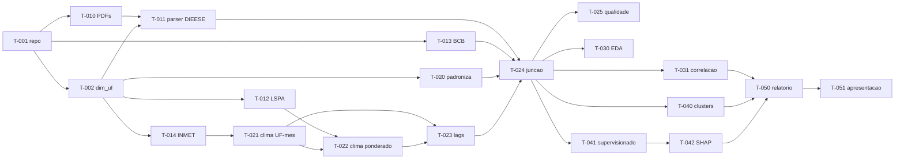

# Tickets — Projeto Cesta Básica × Clima

Backlog do projeto descrito em [PLANO.md](../PLANO.md). Cada ticket é um arquivo com contexto, checklist, critérios de aceite e armadilhas conhecidas.

**Convenções**
- `P0` = bloqueia o projeto · `P1` = necessário para a entrega · `P2` = opcional/diferencial
- Um ticket só é "feito" quando **todos** os critérios de aceite passam.
- Estimativas são para uma pessoa. Total: **~88h**.

---

## Board

### Etapa 0 — Fundação
| ID | Ticket | Prio | Est. | Depende de |
|---|---|---|---|---|
| [T-001](00-fundacao/T-001-estrutura-repo.md) | Estrutura do repositório e ambiente | P0 | 1h | — |
| [T-002](00-fundacao/T-002-dim-uf.md) | Construir `dim_uf.csv` | P0 | 1h | T-001 |

### Etapa 1 — Coleta
| ID | Ticket | Prio | Est. | Depende de |
|---|---|---|---|---|
| [T-010](01-coleta/T-010-dieese-download.md) | Baixar PDFs do DIEESE | P0 | 2h | T-001 |
| [T-011](01-coleta/T-011-dieese-parser.md) | **Parser DIEESE → alvo** ⚠️ gargalo | P0 | 8h | T-010, T-002 |
| [T-012](01-coleta/T-012-sidra-lspa.md) | Coletor SIDRA/LSPA (safra) | P0 | 3h | T-002 |
| [T-013](01-coleta/T-013-bcb-sgs.md) | Coletor BCB/SGS (macro) | P0 | 2h | T-001 |
| [T-014](01-coleta/T-014-inmet.md) | Coletor INMET (clima) | P0 | 6h | T-002 |
| [T-015](01-coleta/T-015-monitor-secas.md) | Coletor Monitor de Secas | P2 | 3h | T-002 |
| [T-016](01-coleta/T-016-conab.md) | Coletor CONAB (safras/custos) | P2 | 4h | T-002 |
| [T-017](01-coleta/T-017-ipca-subitem.md) | Coletor IPCA por subitem | P2 | 2h | T-002 |

### Etapa 2 — Tratamento e junção
| ID | Ticket | Prio | Est. | Depende de |
|---|---|---|---|---|
| [T-020](02-tratamento/T-020-padronizacao.md) | Padronização de chaves e calendário | P0 | 2h | T-002 |
| [T-021](02-tratamento/T-021-clima-uf-mes.md) | Agregação climática estação → UF×mês | P0 | 4h | T-014 |
| [T-022](02-tratamento/T-022-clima-ponderado.md) | **Clima ponderado pela produção** ⭐ | P1 | 5h | T-012, T-021 |
| [T-023](02-tratamento/T-023-features-lag.md) | Features de lag, janelas e extremos | P0 | 4h | T-021, T-022 |
| [T-024](02-tratamento/T-024-juncao-final.md) | Junção final `fato_cesta_uf_mes` | P0 | 3h | T-011, T-013, T-020, T-023 |
| [T-025](02-tratamento/T-025-qualidade.md) | Relatório de qualidade dos dados | P1 | 2h | T-024 |

### Etapa 3 — Análise
| ID | Ticket | Prio | Est. | Depende de |
|---|---|---|---|---|
| [T-030](03-analise/T-030-eda.md) | EDA descritiva | P1 | 4h | T-024 |
| [T-031](03-analise/T-031-correlacao-lag.md) | Correlação e cross-correlation | P0 | 4h | T-024 |

### Etapa 4 — Modelagem
| ID | Ticket | Prio | Est. | Depende de |
|---|---|---|---|---|
| [T-040](04-modelagem/T-040-clustering.md) | Não supervisionado: clusters de capitais | P1 | 4h | T-024 |
| [T-041](04-modelagem/T-041-supervisionado.md) | Supervisionado + validação temporal | P0 | 6h | T-023, T-024 |
| [T-042](04-modelagem/T-042-shap.md) | Interpretação com SHAP | P1 | 3h | T-041 |

### Etapa 5 — Entrega
| ID | Ticket | Prio | Est. | Depende de |
|---|---|---|---|---|
| [T-050](05-entrega/T-050-relatorio.md) | Relatório final | P0 | 6h | T-031, T-040, T-042 |
| [T-051](05-entrega/T-051-apresentacao.md) | Apresentação | P0 | 3h | T-050 |

---

## Grafo de dependências



---

## Caminho crítico

```
T-001 → T-010 → T-011 → T-024 → T-041 → T-042 → T-050 → T-051
```

**T-011 (parser dos PDFs do DIEESE) é o gargalo.** Ele bloqueia a junção, que bloqueia tudo depois. Deve começar no dia 1 e não pode escorregar. Enquanto uma pessoa trabalha nele, o resto do grupo toca T-012, T-013 e T-014 em paralelo — são independentes entre si.

## Sugestão de divisão para 4 pessoas

| Pessoa | Tickets |
|---|---|
| A | T-010, **T-011**, T-025 — o gargalo, dedicação exclusiva no início |
| B | T-002, T-014, T-021, T-023 — trilha clima |
| C | T-012, T-013, T-022, T-024 — trilha safra/macro + junção |
| D | T-030, T-031, T-040 — análise; ajuda A no T-011 na primeira semana |

Modelagem (T-041, T-042) e entrega (T-050, T-051) são feitas pelo grupo todo.

## Ordem de ataque dos opcionais

Se sobrar tempo, nesta ordem de retorno sobre esforço: **T-015** (Monitor de Secas — dado já pronto, mensal, por município) → **T-017** (IPCA por subitem — API, sai rápido, compensa a perda dos preços por produto do DIEESE) → **T-016** (CONAB — o mapeamento safra↔mês dá trabalho).

---

Template para novos tickets: [TEMPLATE.md](TEMPLATE.md)
